# Flowchart: context-injection-engine

## Sources Consulted
- `src/services/worker/http/routes/SearchRoutes.ts:209-249` (handleContextInject)
- `src/services/worker/http/routes/SearchRoutes.ts:258-296` (handleSemanticContext)
- `src/services/context/ContextBuilder.ts:46-186`
- `src/services/context/ContextConfigLoader.ts:17-40`
- `src/services/context/ObservationCompiler.ts:26-189`
- `src/services/context/TokenCalculator.ts:14-78`
- `src/services/context/sections/HeaderRenderer.ts:15-61`
- `src/services/context/sections/TimelineRenderer.ts:21-100`
- `src/services/context/sections/SummaryRenderer.ts:15-65`
- `src/services/context/sections/FooterRenderer.ts:15-42`
- `src/services/context/formatters/AgentFormatter.ts:36-98`
- `src/services/context/formatters/HumanFormatter.ts:35-80`
- `src/services/domain/ModeManager.ts:15-100`

## Happy Path Description

Two-part system. **Route-driven flow** (`/api/context/inject`): GET request with project(s) and `colors=true|false`. Handler parses comma-separated projects (worktree support), imports `generateContext`. ContextBuilder loads mode-specific config (observation types + concepts) from ModeManager, opens SQLite, queries observations and summaries filtered by mode, calculates token economics, and passes raw data to section renderers (Header, Timeline, Summary, Footer). Each renderer branches on `forHuman` — AgentFormatter emits compact markdown for LLMs, HumanFormatter emits ANSI-colored terminal output.

**Semantic flow** (`/api/context/semantic`): POST with user query. Delegates to SearchManager for Chroma similarity, formats top-N as compact markdown with title + narrative. Returns JSON for per-prompt injection.

## Mermaid Flowchart

```mermaid
flowchart TD
    HTTPInject["GET /api/context/inject<br/>SearchRoutes.ts:209"] --> ExtractParams["Extract projects + colors<br/>SearchRoutes.ts:211-212"]
    HTTPSemantic["POST /api/context/semantic<br/>SearchRoutes.ts:258"] --> ExtractParamsSem["Extract q + project + limit<br/>SearchRoutes.ts:259-261"]

    ExtractParams --> ParseProjects["Split comma-separated<br/>SearchRoutes.ts:221"]
    ParseProjects --> GenerateCtx["generateContext<br/>ContextBuilder.ts:130"]

    ExtractParamsSem --> ValidateQuery["len(q) >= 20<br/>SearchRoutes.ts:263"]
    ValidateQuery --> SearchMgr["SearchManager.search via Chroma<br/>SearchRoutes.ts:270"]
    SearchMgr --> FormatSemantic["Top-N markdown<br/>SearchRoutes.ts:287-293"]
    FormatSemantic --> ReturnSemJSON["Return JSON<br/>SearchRoutes.ts:295"]

    GenerateCtx --> LoadConfig["loadContextConfig<br/>ContextBuilder.ts:134"]
    LoadConfig --> ModeLoad["ModeManager.getActiveMode<br/>ContextConfigLoader.ts:22"]
    ModeLoad --> CreateDB["initializeDatabase<br/>ContextBuilder.ts:152"]
    CreateDB --> QueryObs["query observations<br/>ContextBuilder.ts:159"]
    QueryObs --> ObsMulti{Multi-project worktree?}
    ObsMulti -->|Yes| QueryObsMulti["queryObservationsMulti<br/>ObservationCompiler.ts:105"]
    ObsMulti -->|No| QueryObsSingle["queryObservations<br/>ObservationCompiler.ts:26"]
    QueryObsMulti --> QuerySumm["query summaries<br/>ContextBuilder.ts:162"]
    QueryObsSingle --> QuerySumm

    QuerySumm --> CheckEmpty{Empty?<br/>ContextBuilder.ts:167}
    CheckEmpty -->|Yes| RenderEmptyState["renderEmptyState<br/>ContextBuilder.ts:73"]
    CheckEmpty -->|No| BuildCtxOut["buildContextOutput<br/>ContextBuilder.ts:80-122"]

    BuildCtxOut --> CalcEcon["calculateTokenEconomics<br/>TokenCalculator.ts:25"]
    CalcEcon --> RenderHeader["renderHeader<br/>HeaderRenderer.ts:15"]
    RenderHeader --> FormatMode{forHuman?}
    FormatMode -->|true| HumanHeader["HumanFormatter<br/>HumanFormatter.ts:35"]
    FormatMode -->|false| AgentHeader["AgentFormatter<br/>AgentFormatter.ts:36"]

    HumanHeader --> RenderTimeline["renderTimeline<br/>TimelineRenderer.ts"]
    AgentHeader --> RenderTimeline
    RenderTimeline --> GroupDays["groupTimelineByDay<br/>TimelineRenderer.ts:21"]
    GroupDays --> IterateDays[/"For each day"/]
    IterateDays --> FormatDay{forHuman?}
    FormatDay -->|true| RenderDayHuman["renderDayTimelineHuman<br/>TimelineRenderer.ts:97"]
    FormatDay -->|false| RenderDayAgent["renderDayTimelineAgent<br/>TimelineRenderer.ts:56"]

    RenderDayAgent --> CheckSummary["shouldShowSummary<br/>SummaryRenderer.ts:15"]
    RenderDayHuman --> CheckSummary
    CheckSummary --> RenderPrev["renderPreviouslySection<br/>FooterRenderer.ts:15"]
    RenderPrev --> JoinLines["Join + trim<br/>ContextBuilder.ts:121"]
    JoinLines --> HTTPReturn["Return text/plain<br/>SearchRoutes.ts:247"]
```

## Side Effects

- DB connection opened, closed in finally (ContextBuilder.ts:184).
- Mode state (ModeManager singleton) drives all filtering.
- Read-only — no writes during generation.
- Semantic path queries Chroma; inject path is SQLite-only.

## External Feature Dependencies

**Calls into:** ModeManager, SessionStore (SQLite), SearchManager (semantic path only), SettingsDefaultsManager, timeline-formatting utilities.

**Called by:** lifecycle-hooks (SessionStart context + UserPromptSubmit semantic), `/api/context/inject` clients (viewer UI), transcript-watcher post-session-end refresh.

## Confidence + Gaps

**High:** Route entry points; orchestration pipeline; mode filtering; Agent vs Human formatter split; token economics.

**Gaps:** HumanFormatter ANSI detail; ModeManager deep-merge inheritance; prior-session message extraction. No duplication observed internally — AgentFormatter/HumanFormatter are cleanly separated by audience.
