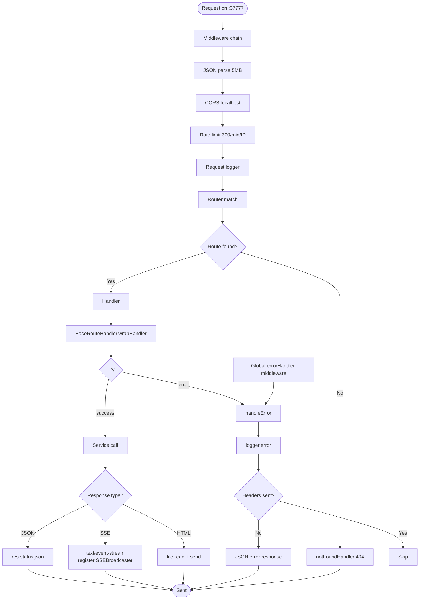

# Flowchart: http-server-routes

## Sources Consulted
- `src/services/server/Server.ts:1-286`
- `src/services/server/Middleware.ts`
- `src/services/server/ErrorHandler.ts`
- `src/services/worker/http/middleware.ts`
- `src/services/worker/http/BaseRouteHandler.ts`
- All 8 route files under `src/services/worker/http/routes/`

## Route Inventory

| File | Endpoints | Method(s) | Purpose |
|---|---|---|---|
| ViewerRoutes.ts | `/`, `/health`, `/stream` | GET | UI HTML; SSE broadcaster |
| SearchRoutes.ts | `/api/search`, `/api/timeline`, `/api/decisions`, `/api/changes`, `/api/how-it-works`, `/api/search/*`, `/api/context/*` | GET/POST | Search + context injection |
| SessionRoutes.ts | `/sessions/:id/*`, `/api/sessions/*` | POST/GET/DELETE | Session init/observations/summarize/complete |
| DataRoutes.ts | `/api/observations`, `/api/summaries`, `/api/prompts`, `/api/stats`, `/api/projects`, `/api/processing-status`, `/api/pending-queue` | GET/POST/DELETE | Data retrieval + queue mgmt |
| SettingsRoutes.ts | `/api/settings`, `/api/mcp/*`, `/api/branch/*` | GET/POST | Settings + MCP toggle + branch |
| MemoryRoutes.ts | `/api/memory/save` | POST | Manual observation insert |
| CorpusRoutes.ts | `/api/corpus`, `/api/corpus/:name/*` | GET/POST/DELETE | Knowledge corpus CRUD |
| LogsRoutes.ts | `/api/logs`, `/api/logs/clear` | GET/POST | Log retrieval |
| Server.ts core | `/api/health`, `/api/readiness`, `/api/version`, `/api/instructions`, `/api/admin/*` | GET/POST | System health + admin |

## Happy Path Description

Request → middleware chain (JSON parse 5MB → CORS localhost → rate limit 300/min → request logging) → Express router → route handler extends `BaseRouteHandler` (provides `wrapHandler()` catching sync/async errors) → service call (SearchManager, DatabaseManager, etc.) → response (JSON, SSE, HTML). Global `errorHandler` catches uncaught errors. Admin endpoints require localhost.

## Mermaid Flowchart

## Repeated Patterns (Phase 2 candidates)

1. **Try-catch wrapping:** All routes inherit `BaseRouteHandler.wrapHandler()` — consistent, good.
2. **Validation:** Each route validates query/body **independently** — no shared validator middleware. Duplicated shape.
3. **Service injection:** Constructors accept services — consistent DI.
4. **Response shape:**
   - Success: `res.status(200).json({ ... })`
   - Error: `{ error, message, code?, details? }`
   - 404: `notFoundHandler`
   - 500: global errorHandler
5. **SSE is structurally different:** stateful persistent connection; managed by `SSEBroadcaster`.

## Side Effects

- SSE client registration grows connection list until close.
- Rate limiter in-memory IP map.
- Logger writes (stderr, async).
- Admin endpoints: `/api/admin/restart` and `/api/admin/shutdown` call `process.exit(0)`.
- File I/O for `/`, `/api/instructions`, `/api/logs` (synchronous).

## External Feature Dependencies

SearchManager, SessionManager, DatabaseManager, SSEBroadcaster, SettingsManager, BranchManager, ModeManager, CorpusStore/Builder/KnowledgeAgent, logger, AppError, Supervisor/ProcessRegistry.

## Confidence + Gaps

**High:** Middleware order; BaseRouteHandler pattern; error shape; SSE setup.

**Gaps:** No auth/permission middleware (single-machine trust model assumed); validator duplication; blocking synchronous file I/O in `/` and `/api/instructions`; SSE race on connect-mid-broadcast.
