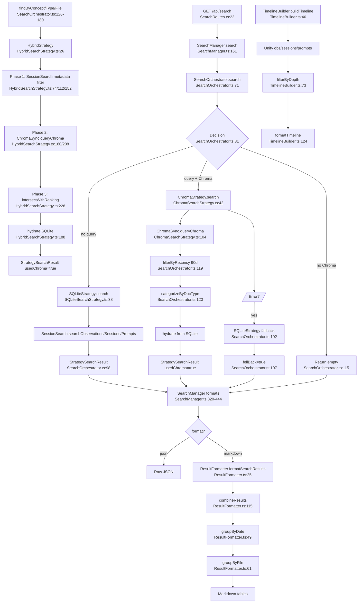

# Flowchart: hybrid-search-orchestration

## Sources Consulted
- `src/services/worker/search/SearchOrchestrator.ts:1-290`
- `src/services/worker/search/strategies/ChromaSearchStrategy.ts:1-120`
- `src/services/worker/search/strategies/SQLiteSearchStrategy.ts:1-120`
- `src/services/worker/search/strategies/HybridSearchStrategy.ts:1-240`
- `src/services/worker/search/ResultFormatter.ts:1-200`
- `src/services/worker/search/TimelineBuilder.ts:1-220`
- `src/services/worker/SearchManager.ts:1-600`
- `src/services/worker/http/routes/SearchRoutes.ts:1-150`

## Happy Path Description

`/api/search` → `SearchRoutes` → `SearchManager.search()` (thin facade) → `SearchOrchestrator` chooses among three strategies:

**Path 1 (Filter-only):** No query text → `SQLiteSearchStrategy` does metadata-only filter via SessionSearch (date range, project, concept/type/file).

**Path 2 (Semantic):** Query text + ChromaSync available → `ChromaSearchStrategy.queryChroma` → filter by recency (90-day default or custom) → categorize by doc type → hydrate from SQLite. If Chroma fails mid-query, orchestrator falls back to filter-only SQLite (drops the query term).

**Path 3 (Hybrid):** `findByConcept|Type|File` specialty methods → `HybridSearchStrategy` two-phase: (1) SQLite metadata filter → all matching IDs; (2) Chroma semantic ranking → re-rank; (3) intersect + hydrate → return metadata-matched IDs in Chroma rank order.

`ResultFormatter` renders markdown tables grouped by date/file. `TimelineBuilder` handles chronological grouping with anchor-based depth filtering.

## Mermaid Flowchart

## Side Effects

- Chroma unavailability → fallback to filter-only SQLite (drops query text).
- Default 90-day recency filter unless `dateRange` is explicit.
- HybridStrategy errors → metadata-only results with `fellBack=true`.
- SearchManager normalizes comma-separated URL params → arrays.

## External Feature Dependencies

**Calls into:** ChromaSync, SessionSearch (SQLite FTS5), SessionStore (hydration), ModeManager (type icons), timeline-formatting helpers.

**Called by:** Search routes, mem-search skill, CorpusBuilder (via SearchOrchestrator).

## Important Clarification: SearchManager vs SearchOrchestrator

- **SearchOrchestrator** is the canonical strategy coordinator introduced in Jan 2026 monolith refactor.
- **SearchManager** is a **thin facade** delegating to SearchOrchestrator, plus HTTP/display wrapping.
- **NOT duplicates.** But SearchManager retains legacy private methods (`queryChroma`, `searchChromaForTimeline` marked `@deprecated`) — candidates for cleanup.

## Confidence + Gaps

**High:** Three paths + fallback chains; SearchManager is thin facade; TimelineBuilder is standalone formatter.

**Gaps:** Pagination enforcement across strategies; CorpusBuilder's exact call into SearchOrchestrator; deprecated SearchManager methods still present.
