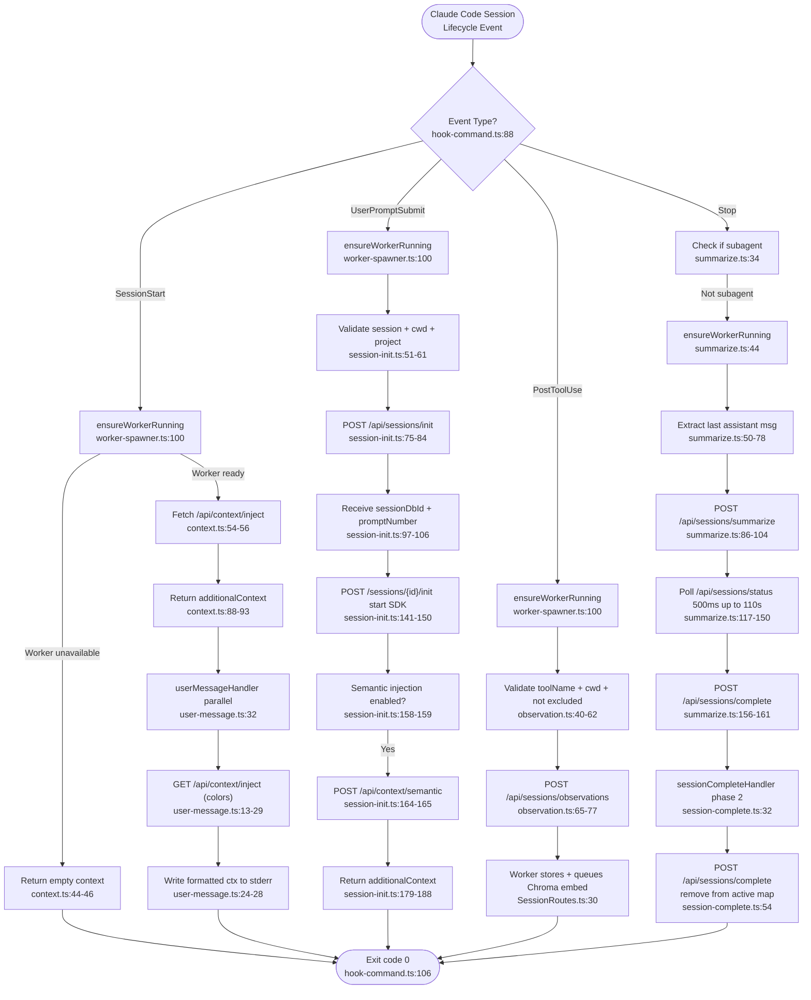

# Flowchart: lifecycle-hooks

## Sources Consulted
- `src/cli/hook-command.ts:1-122`
- `src/cli/handlers/index.ts:1-72`
- `src/cli/handlers/context.ts:1-95` (SessionStart)
- `src/cli/handlers/session-init.ts:1-192` (UserPromptSubmit)
- `src/cli/handlers/observation.ts:1-86` (PostToolUse)
- `src/cli/handlers/summarize.ts:1-170` (Stop / Summary phase)
- `src/cli/handlers/session-complete.ts:1-66` (Stop / Completion phase)
- `src/cli/handlers/user-message.ts:1-54` (SessionStart parallel)
- `src/cli/adapters/claude-code.ts:1-45`
- `src/hooks/hook-response.ts:1-12`
- `src/shared/hook-constants.ts:1-35`
- `src/services/worker-service.ts:1-100`
- `src/supervisor/index.ts:1-100`
- `src/services/worker/http/routes/SessionRoutes.ts:1-330`
- `src/services/worker/http/routes/SearchRoutes.ts:1-150`
- `src/services/infrastructure/GracefulShutdown.ts:1-100`
- `src/supervisor/process-registry.ts:1-80`
- `src/services/worker-spawner.ts:1-150`

## Happy Path Description

Claude-Mem's lifecycle-hooks system intercepts Claude Code's session lifecycle events and routes them through specialized handlers that coordinate session tracking, tool observation capture, semantic context injection, and session summarization.

**SessionStart** fires immediately when a session begins. The **context handler** ensures the worker daemon is running, queries the Chroma vector database for relevant past observations, and returns them as `additionalContext` for injection into Claude's prompt. In parallel, **user-message** displays formatted context information to the user's terminal and broadcasts the worker's live dashboard URL. Both handlers gracefully degrade if the worker is unavailable.

**UserPromptSubmit** fires when the user submits their first prompt. The **session-init handler** calls `/api/sessions/init` to create a session record in the database, captures the prompt, checks privacy settings, and optionally starts the Claude SDK agent. If semantic injection is enabled, it fetches relevant observations via `/api/context/semantic` and injects them as additional context alongside the user's prompt.

**PostToolUse** fires after Claude executes each tool. The **observation handler** sends the tool usage (name, input, response) to `/api/sessions/observations` where the worker validates privacy rules, enriches the observation with cwd/platform metadata, stores it in SQLite, and queues an async Chroma embedding for semantic search.

**Stop** hook fires when a session ends. This is split into two phases with different timing guarantees: **summarize handler** queues the session's final assistant message to `/api/sessions/summarize` and then polls `/api/sessions/status` to wait (up to 110s) for the SDK agent to finish processing the summary, then calls `/api/sessions/complete`. The **session-complete handler** (phase 2) marks the session inactive in the sessions map.

## Mermaid Flowchart

## Side Effects

**HTTP Calls to Worker (port 37777):**
- `GET /api/context/inject` — returns markdown context for injection
- `POST /api/sessions/init` — creates session record, returns sessionDbId
- `POST /api/context/semantic` — semantic search on Chroma
- `POST /sessions/{sessionDbId}/init` — starts SDK agent
- `POST /api/sessions/observations` — stores tool usage observation
- `POST /api/sessions/summarize` — queues summary generation
- `GET /api/sessions/status` — polls queue length
- `POST /api/sessions/complete` — marks session inactive

**Database (SQLite via worker):**
- Inserts into `sdk_sessions`, `user_prompts`, `observations`
- Updates `sdk_sessions.summary` with `summary_stored` flag

**Process Management:**
- `ensureWorkerStarted` spawns worker daemon via `spawnDaemon` if not alive
- SDK agent subprocess spawned per session
- Summarize handler waits up to 110s for SDK agent to finish

**File I/O:**
- Worker PID file at `~/.claude-mem/worker.pid`
- Hook logs at `~/.claude-mem/logs/hook.log`

## External Feature Dependencies

**Calls into:**
- **context-injection-engine** (via `/api/context/inject`, `/api/context/semantic`)
- **sqlite-persistence** (all writes via worker HTTP)
- **vector-search-sync** (async Chroma embeds)
- **session-lifecycle-management** (session state, SDK subprocess)
- **privacy-tag-filtering** (observation content filtered before storage)
- **http-server-routes** (all HTTP communication)

**Called by:**
- Claude Code CLI plugin harness (registered hooks)
- Cursor IDE (routed through observation handler)
- Gemini CLI / OpenRouter adapters

## Confidence + Gaps

**High Confidence:** Hook lifecycle → handler mapping; HTTP endpoints + payloads; graceful degradation on worker unavailability; exit code 0 strategy.

**Medium Confidence:** Exact SDK agent lifecycle and crash recovery; Cursor hook integration paths.

**Gaps:** Hook installer (how hooks register in Claude Code settings); TypeScript build → CLI entry process.
