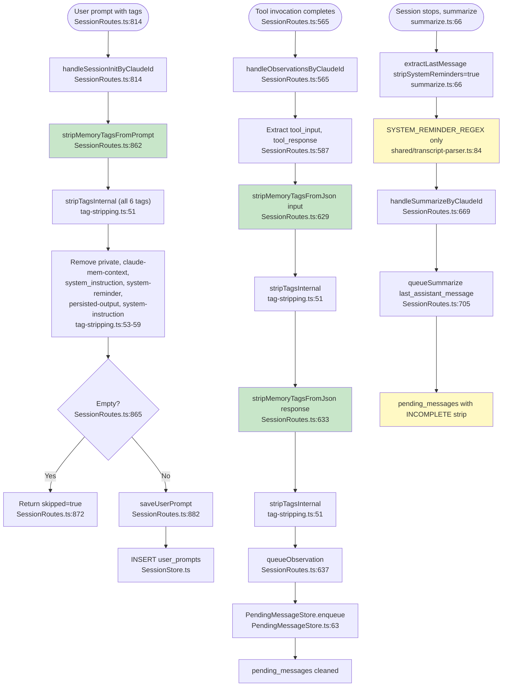

# Flowchart: privacy-tag-filtering

## Sources Consulted
- `src/utils/tag-stripping.ts:1-92`
- `src/services/worker/http/routes/SessionRoutes.ts:1-900`
- `src/services/worker/SessionManager.ts:270-360`
- `src/services/sqlite/PendingMessageStore.ts:1-100`
- `src/cli/handlers/summarize.ts:1-150`
- `src/shared/transcript-parser.ts:1-130`

## Happy Path Description

User submits a prompt containing `<private>` tags via hook → Worker HTTP endpoint `/api/sessions/init` receives request → `SessionRoutes.handleSessionInitByClaudeId` (line 814) validates and extracts the prompt. At line 862, `stripMemoryTagsFromPrompt()` is called, which invokes `stripTagsInternal()` to remove six tag types: `<claude-mem-context>`, `<private>`, `<system_instruction>`, `<system-instruction>`, `<persisted-output>`, and `<system-reminder>`. The cleaned prompt is saved to `user_prompts`. Concurrently, tool observations flow through `handleObservationsByClaudeId` (line 565), where `tool_input` and `tool_response` are stringified and stripped via `stripMemoryTagsFromJson()` (lines 629, 633), then queued to `PendingMessageStore` as already-cleaned data.

Stripping occurs BEFORE persistence, ensuring the database never receives unfiltered content. However, the **assistant-message summarize path** only strips `<system-reminder>` at extraction time (summarize.ts:66), not the full suite — a known gap.

## Mermaid Flowchart

## Call Sites Inventory

| Location | Function | Data Protected | Tag Types | Entry |
|---|---|---|---|---|
| `SessionRoutes.ts:862` | `stripMemoryTagsFromPrompt()` | User prompts | All 6 | handleSessionInitByClaudeId |
| `SessionRoutes.ts:629` | `stripMemoryTagsFromJson()` | Tool inputs | All 6 | handleObservationsByClaudeId |
| `SessionRoutes.ts:633` | `stripMemoryTagsFromJson()` | Tool responses | All 6 | handleObservationsByClaudeId |
| `transcript-parser.ts:84` | `SYSTEM_REMINDER_REGEX` | None (read-time) | system-reminder only | Context extraction |
| `transcript-parser.ts:128` | `SYSTEM_REMINDER_REGEX` | None (read-time) | system-reminder only | Context extraction |
| `summarize.ts:66` | `extractLastMessage(..., true)` | Assistant msgs (summary path) | system-reminder only | Hook summarize handler |
| `SessionRoutes.ts:378` (LEGACY) | `handleObservations()` | Tool observations | **NONE** | Unused endpoint |

## Side Effects

- **ReDoS protection**: counts tags before regex, warns if > MAX_TAG_COUNT=100 (tag-stripping.ts:56-60).
- **Whitespace trim** after all replacements (tag-stripping.ts:65).
- **Multiple regex passes** — one per tag type. Could be unified.

## External Feature Dependencies

- **PrivacyCheckValidator** (SessionRoutes.ts:614) — after stripping, validates empty-result handling.
- **PendingMessageStore** — receives pre-cleaned data; no re-strip.
- **ResponseProcessor** — consumes pending messages; no re-strip.
- **ChromaSync** — operates on already-sanitized text from DB.

## Confidence + Gaps

**High confidence:** User prompts + tool observations fully stripped before DB write; ReDoS protection active.

**Known gaps:**
1. Assistant messages in summary path only strip `<system-reminder>`, not full suite (summarize.ts:66, SessionRoutes.ts:669).
2. Legacy endpoint `SessionRoutes.ts:378` has no stripping — stale route.
3. `stripTagsInternal` is called from two public wrappers (`stripMemoryTagsFromPrompt`, `stripMemoryTagsFromJson`) that differ only by caller context — minor DRY violation.
