# Flowchart: response-parsing-storage

## Sources Consulted
- `src/services/worker/agents/ResponseProcessor.ts:49` (processAgentResponse)
- `src/sdk/parser.ts:1` (parseObservations, parseSummary, helpers)
- `src/services/worker/agents/ObservationBroadcaster.ts`
- `src/services/worker/agents/SessionCleanupHelper.ts`
- `src/services/sqlite/SessionStore.ts:1916` (storeObservations atomic)
- `src/services/worker/SDKAgent.ts`, `OpenRouterAgent.ts`, `GeminiAgent.ts` (callers)
- `src/services/sqlite/PendingMessageStore.ts`

## Happy Path Description

Agent returns final assistant text → `parseObservations` extracts `<observation>` blocks via regex, validates types, filters empty observations → `parseSummary` extracts `
` (fallback coercion from observations if summary missing and `summaryExpected=true`) → ResponseProcessor detects non-XML responses (auth errors, garbage) and fails early → atomic transaction wraps both observation and summary storage with content-hash dedup → `confirmProcessed` deletes pending message (only AFTER commit) → SSE broadcasts observations + summaries → Chroma sync fire-and-forget → SessionCleanupHelper resets timestamp and broadcasts status → RestartGuard records success.

## Mermaid Flowchart

```mermaid
flowchart TD
    A([Agent Returns Text<br/>SDKAgent.ts:266 / OpenRouterAgent.ts / GeminiAgent.ts]) --> B["processAgentResponse<br/>ResponseProcessor.ts:49"]
    B --> C["Track lastGeneratorActivity"]
    C --> D["Add to conversationHistory"]

    D --> E["parseObservations<br/>parser.ts:33"]
    E --> E1["Regex &lt;observation&gt; blocks"]
    E1 --> E2["extractField / extractArrayElements"]
    E2 --> E3["Validate type vs ModeManager"]
    E3 --> E4["Skip ghost observations"]
    E4 --> E6["ParsedObservation[]"]

    D --> F["parseSummary<br/>parser.ts:122"]
    F --> F1["Check &lt;skip_summary/&gt;"]
    F1 --> F2["Regex &lt;summary&gt; block"]
    F2 --> F5["coerceObservationToSummary fallback<br/>parser.ts:222"]
    F5 --> F7["ParsedSummary or null"]

    E6 --> G{Non-XML response?<br/>no tags + no obs}
    F7 --> G
    G -->|Yes| G2["Mark processingMessageIds FAILED"]
    G2 --> G3([Return early])
    G -->|No| H["Normalize null → empty string"]

    H --> K["ATOMIC TX<br/>sessionStore.storeObservations<br/>SessionStore.ts:1916"]
    K --> K1["computeContentHash"]
    K1 --> K2["findDuplicateObservation 30s window"]
    K2 --> K3["INSERT observations (or reuse id)"]
    K3 --> K5["INSERT session_summaries if present"]
    K5 --> K6["Return ids + epoch"]

    K6 --> N["Circuit breaker: consecutiveSummaryFailures"]
    N --> O["CLAIM-CONFIRM<br/>pendingStore.confirmProcessed each id"]
    O --> O3["session.restartGuard.recordSuccess"]

    O3 --> Q["syncAndBroadcastObservations<br/>ResponseProcessor.ts:270"]
    Q --> Q1["getChromaSync().syncObservation FnF"]
    Q1 --> Q2["worker.broadcastObservation SSE"]
    Q2 --> Q3["Update folder CLAUDE.md if enabled"]

    O3 --> R["syncAndBroadcastSummary<br/>ResponseProcessor.ts:363"]
    R --> R1["syncSummary FnF"]
    R1 --> R2["broadcastSummary SSE"]

    Q3 --> S["cleanupProcessedMessages<br/>SessionCleanupHelper.ts:26"]
    R2 --> S
    S --> S1["Reset earliestPendingTimestamp"]
    S1 --> S2["broadcastProcessingStatus"]
    S2 --> T([End])
```

## Parsing Inventory

| Parser | Location | Tags | Notes |
|---|---|---|---|
| `parseObservations` | parser.ts:33 | `<observation>`, `<type>`, `<title>`, `<subtitle>`, `<narrative>`, `<facts>`, `<concept>`, `<files_read>`, `<files_modified>` | Validates types vs ModeManager; filters empty |
| `parseSummary` | parser.ts:122 | `
`, `<skip_summary/>`, `<request>`, `<investigated>`, `<learned>`, `<completed>`, `<next_steps>`, `<notes>` | Skip-marker first; false-positive detection |
| `coerceObservationToSummary` | parser.ts:222 | obs → summary mapping | Fallback when summary missing + expected (#1633) |
| `extractField` | parser.ts:267 | Generic `<X>...</X>` | Non-greedy regex handles nested tags |
| `extractArrayElements` | parser.ts:282 | Generic `<Arr><Elem>...</Elem></Arr>` | Non-greedy, trims empties |

**Single parser architecture.** All XML parsing through `src/sdk/parser.ts`. No duplicate parsing layers.

## Side Effects

- Message queue cleanup via `confirmProcessed` (DELETE after commit).
- Chroma sync async fire-and-forget.
- SSE broadcasting to web UI.
- CLAUDE.md folder sync (feature-flagged).
- Session state tracking: `lastGeneratorActivity`, `lastSummaryStored`, `consecutiveSummaryFailures`, `restartGuard` metrics.

## External Feature Dependencies

**Calls into:** ModeManager (type validation), SettingsDefaultsManager, ChromaSync, SSEBroadcaster, PendingMessageStore, SessionStore.

**Called by:** SDKAgent, OpenRouterAgent, GeminiAgent (all agent providers).

## Confidence + Gaps

**High:** Single parser; atomic transaction; claim-confirm ordering; non-XML early-fail; coercion fallback.

**Gaps:** Chroma sync error propagation specifics; CLAUDE.md update error paths; content-hash window boundary conditions.
