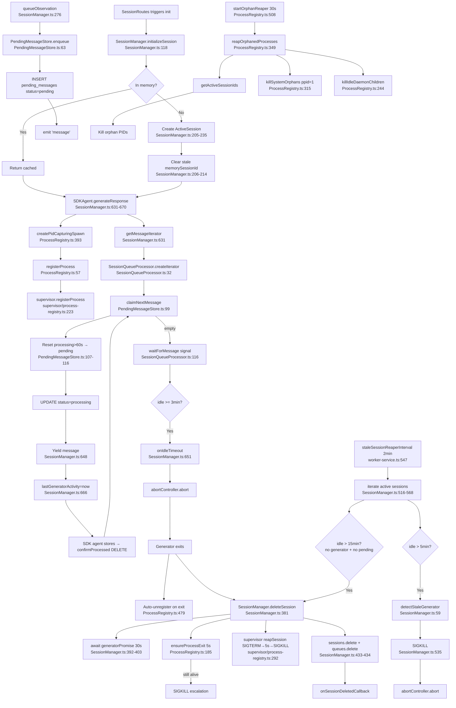

# Flowchart: session-lifecycle-management

## Sources Consulted
- `src/services/worker/SessionManager.ts:1-678`
- `src/services/worker/ProcessRegistry.ts:1-528`
- `src/services/queue/SessionQueueProcessor.ts:1-149`
- `src/services/sqlite/PendingMessageStore.ts:1-150`
- `src/supervisor/process-registry.ts:175-409`
- `src/services/worker-service.ts:173-174, 508-560, 1100-1111`

## Happy Path Description

1. HTTP request (SessionRoutes) triggers `SessionManager.initializeSession(sessionDbId)` (SessionManager.ts:118).
2. ActiveSession created in-memory with AbortController; stale memorySessionId cleared from DB (205-235).
3. SDK subprocess spawned via `createPidCapturingSpawn` → registered in supervisor ProcessRegistry (393, 57, supervisor/process-registry.ts:223).
4. Observations persisted to `PendingMessageStore` (claim-confirm) before processing (SessionManager.ts:276, PendingMessageStore.ts:63).
5. `SessionQueueProcessor.createIterator` yields messages via EventEmitter; resets stale-processing >60s on claim (SessionQueueProcessor.ts:32, PendingMessageStore.ts:99).
6. SDKAgent consumes iterator, updates `lastGeneratorActivity` per yield (SessionManager.ts:666).
7. Messages confirmed only after successful DB commit (prevents loss on crash).
8. Idle timeout (3 min) → `onIdleTimeout` → `session.abortController.abort()` → generator exits → session deleted (SessionManager.ts:651-655, 381).
9. Stuck-generator detection (5 min inactive) → `reapStaleSessions` SIGKILLs subprocess (516-568, 535).
10. Orphan reaper (30s) cleans dead sessions + system orphans + idle daemon children (ProcessRegistry.ts:349).

## Mermaid Flowchart

## Timer Inventory

| Timer | Purpose | Lifetime | Cleared On | Location |
|---|---|---|---|---|
| `waitForMessage()` setTimeout | Wait for next message or idle | Per message | clearTimeout or abort | SessionQueueProcessor.ts:145 |
| Idle timeout | Trigger onIdleTimeout at 3min | Per iterator session | resolves or signal aborts | SessionQueueProcessor.ts:130 |
| `staleSessionReaperInterval` | Reap stuck gens (5min) + old sessions (15min) | Worker lifetime | clearInterval on shutdown | worker-service.ts:547, 1108 |
| Orphan reaper (`startOrphanReaper`) | Kill dead-session procs, orphans, idle daemons | Worker lifetime | clearInterval returned | ProcessRegistry.ts:508 |
| Stale-processing self-heal | Atomic UPDATE reset >60s | Per claim (inline SQL) | n/a | PendingMessageStore.ts:106 |
| Generator-exit wait | 30s timeout on deleteSession | Per delete | AbortSignal.timeout + Promise.race | SessionManager.ts:397 |
| `ensureProcessExit` | 5s before SIGKILL | Per delete | setTimeout for escalation | ProcessRegistry.ts:200 |

## Side Effects

- Process registration persisted to supervisor.json.
- PendingMessage lifecycle persisted to SQLite (INSERT → UPDATE → DELETE).
- AbortController cascades through iterator.
- Pool-slot notification on process exit.
- Broadcast callbacks on session delete.

## External Feature Dependencies

**Calls into:** SQLite (pending_messages + sessions), supervisor ProcessRegistry, SDKAgent, RestartGuard, SSEBroadcaster.

**Called by:** SessionRoutes, DataRoutes, worker-service lifecycle (reapers, shutdown).

## Confidence + Gaps

**High:** Happy path; stale detection thresholds (5min generator, 15min session); 3-min idle timeout; 30s orphan reaper; claim-confirm; supervisor-delegated registry model.

**KNOWN GAPS (critical for duplication analysis):**

1. **ProcessRegistry duplication:** YES — two files exist:
   - `src/services/worker/ProcessRegistry.ts` — worker-level facade
   - `src/supervisor/process-registry.ts` — supervisor-level persistent registry
   - NOT fully independent; worker-level delegates via `getSupervisor().getRegistry()`. But there is real surface-area duplication.

2. **staleSessionReaperInterval vs startUnifiedReaper:**
   - `staleSessionReaperInterval` is ACTIVE at worker-service.ts:547.
   - `startUnifiedReaper` NOT present in codebase search — observation notes suggest T31/T32 refactor planned to unify the two reapers but NOT yet implemented.
   - Currently TWO independent reapers: `startOrphanReaper` (30s) + stale-session reaper (2min). Unification pending.

3. **MAX_SESSION_IDLE_MS (15 min)** is used only by reapStaleSessions — may be deprecated but code still in place.
