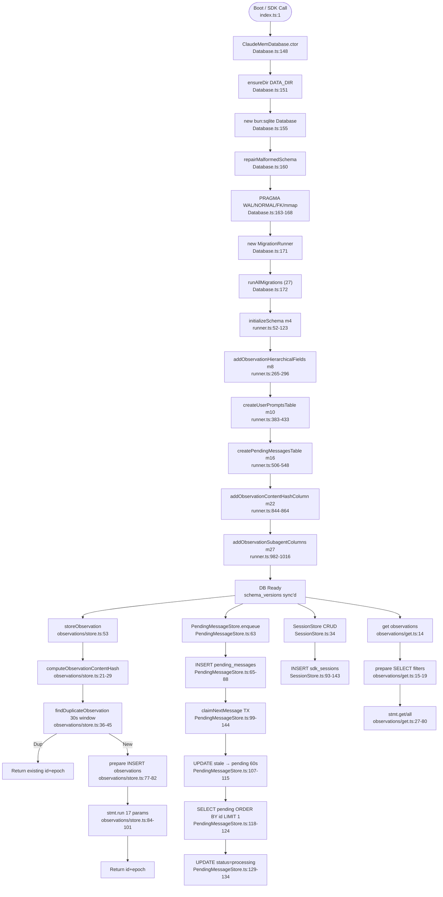

# Flowchart: sqlite-persistence

## Sources Consulted
- `src/services/sqlite/Database.ts:1-349`
- `src/services/sqlite/migrations/runner.ts:1-1019`
- `src/services/sqlite/observations/store.ts:1-108`
- `src/services/sqlite/SessionStore.ts:1-500`
- `src/services/sqlite/PendingMessageStore.ts:1-150`
- `src/services/sqlite/index.ts:1-33`

## Happy Path Description

On startup, `ClaudeMemDatabase` opens a bun:sqlite connection to `DB_PATH`, optionally heals malformed schemas via Python sqlite3 wrapper, then applies PRAGMAs for WAL journaling and performance tuning (memory mapping, foreign keys, cache settings). The `MigrationRunner` runs 27 migrations in sequence, creating or altering core tables (`sdk_sessions`, `observations`, `session_summaries`, `user_prompts`, `pending_messages`) and their FTS5 virtual indexes. Each migration checks actual schema state via `PRAGMA table_info` to ensure idempotence across fresh installs, partial migrations, and cross-machine syncs.

A write cycle (e.g., `storeObservation`) computes a content hash for deduplication, checks for recent duplicates within a 30-second window, and if unique, INSERTs into `observations` with all structured fields. Reads use prepared statements with optional filtering, leveraging indexes on `created_at_epoch DESC`. Transaction boundaries are explicit via `db.transaction(fn)` wrappers. `PendingMessageStore.claimNextMessage()` self-heals stale processing messages (>60s) back to pending in a single transaction.

## Mermaid Flowchart

## Tables Owned

| Table | Owner | Purpose |
|---|---|---|
| `schema_versions` | MigrationRunner | Migration tracking |
| `sdk_sessions` | SessionStore | User + worker sessions |
| `observations` | Observations module | Work items (findings, actions) |
| `session_summaries` | Summaries module | Session conclusions |
| `user_prompts` | Prompts module | User input history |
| `pending_messages` | PendingMessageStore | Work queue (claim-confirm) |
| `observation_feedback` | SessionStore | Usage signals |
| `observations_fts` (virtual) | SessionSearch | FTS5 index |
| `session_summaries_fts` (virtual) | SessionSearch | FTS5 index |
| `user_prompts_fts` (virtual) | SessionStore | FTS5 index |

## Side Effects

**File I/O**: DB file, WAL (`db.sqlite-wal`), shared-memory (`db.sqlite-shm`).

**PRAGMAs**: `journal_mode=WAL`, `synchronous=NORMAL`, `foreign_keys=ON`, `temp_store=MEMORY`, `mmap_size=256MB`, `cache_size=10_000`.

**Transactions**: Single-connection architecture; explicit `db.transaction(fn)` for multi-step writes; `claimNextMessage` self-heals via transactional UPDATE.

**Schema Repair**: Python `sqlite3` subprocess invoked via `execFileSync('python3', ...)` for malformed-file recovery.

## External Feature Dependencies

**Called by:** SDK agents (observations/summaries), Response Processor, Search routes, Data import/export, Worker lifecycle.

**Calls into:** `bun:sqlite` driver, Python sqlite3 (repair only), logger, paths utility.

## Confidence + Gaps

**High:** init flow, migrations 4/16/22/27, dedup via content_hash + 30s window, claim-confirm with 60s stale reset.

**Medium:** FTS5 trigger mechanics, transaction isolation semantics under WAL.

**Gaps:** No explicit connection pool (single-writer via WAL); backup/restore not in scope.
