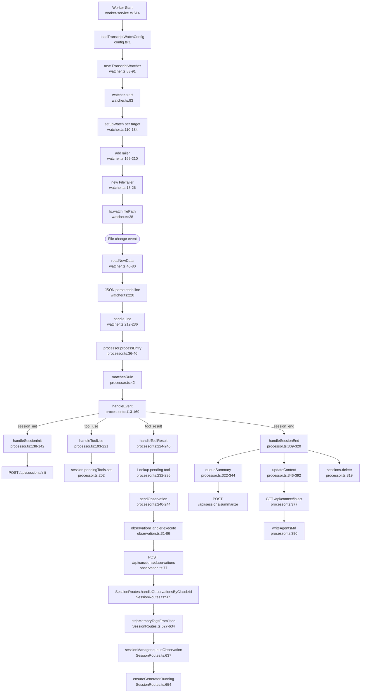

# Flowchart: transcript-watcher-integration

## Sources Consulted
- `src/services/transcripts/watcher.ts:1-242`
- `src/services/transcripts/processor.ts:33-393`
- `src/services/transcripts/config.ts:1-100`
- `src/services/transcripts/types.ts:1-71`
- `src/services/worker-service.ts:91, 164, 466, 614-658`
- `src/services/integrations/CursorHooksInstaller.ts:1-100`
- `src/cli/handlers/observation.ts:1-87`
- `src/services/worker/http/routes/SessionRoutes.ts:378-660`

## Happy Path Description

Worker startup loads transcript-watch config and instantiates `TranscriptWatcher`. `FileTailer` uses `fs.watch()` on each JSONL transcript; on growth, reads new bytes and splits by newline. Each line is `JSON.parse`d and routed to `TranscriptEventProcessor.processEntry()`, which matches schema rules to classify the event (`session_init`, `tool_use`, `tool_result`, `session_end`). Per-session `SessionState` holds `pendingTools` map: `tool_use` stores name+input; `tool_result` retrieves pending, pairs with response, and calls `observationHandler.execute()` — which POSTs to `/api/sessions/observations` (the same endpoint used by lifecycle-hooks). On `session_end`, processor queues summary via `/api/sessions/summarize` and refreshes Cursor context via `/api/context/inject`.

## Mermaid Flowchart

## Side Effects

- Byte-offset state persisted to `transcript-watch-state.json`.
- Rescan timer every 5s for new transcript files (watcher.ts:124).
- PendingTools map state cleared after each paired observation.
- `AGENTS.md` context file written by Cursor session_end.
- SSE broadcast via existing pipeline when observations queued.

## External Feature Dependencies

**Calls into:** observationHandler (bridge), `/api/sessions/observations` endpoint (shared with lifecycle-hooks), `/api/sessions/summarize`, `/api/context/inject`. SessionManager processes identically regardless of source.

**Called by:** Worker-service initialization only; not user-invoked.

## Duplication with lifecycle-hooks?

**YES — significant re-implementation.** Both paths ingest observations, but via different capture mechanisms:

| Aspect | lifecycle-hooks | transcript-watcher |
|---|---|---|
| Source | Cursor/Claude Code PostToolUse hook | JSONL file via fs.watch + FileTailer |
| Tool pairing | Hook receives tool_name + response atomically | pendingTools map pairs tool_use + tool_result |
| Session init | observationHandler → sessionInitHandler | processor directly calls sessionInitHandler |
| HTTP transport | observationHandler → `/api/sessions/observations` | observationHandler → `/api/sessions/observations` (same) |
| Exclusion check | observationHandler checks `isProjectExcluded` | processor may skip this check; SessionRoutes enforces privacy |
| Storage convergence | SessionRoutes queue → SessionManager → SDK agent | SessionRoutes queue → SessionManager → SDK agent (same) |

**Conclusion:** transcript-watcher is a **parallel capture path** that re-implements session-init + observation dispatch logic but converges at the same HTTP endpoint. The pendingTools state machine is unique to transcripts. This is the clearest cross-feature duplication in the codebase and a prime target for Phase 3 unification.

## Confidence + Gaps

**High:** TranscriptWatcher → FileTailer → processor → observationHandler → shared HTTP endpoint.

**Medium:** Privacy filter coverage when bypassing observationHandler's exclusion check.

**Gaps:** FileTailer retry strategy on I/O errors; schema FieldSpec coalesce/default evaluation details; updateContext timing relative to sessionCompleteHandler.
