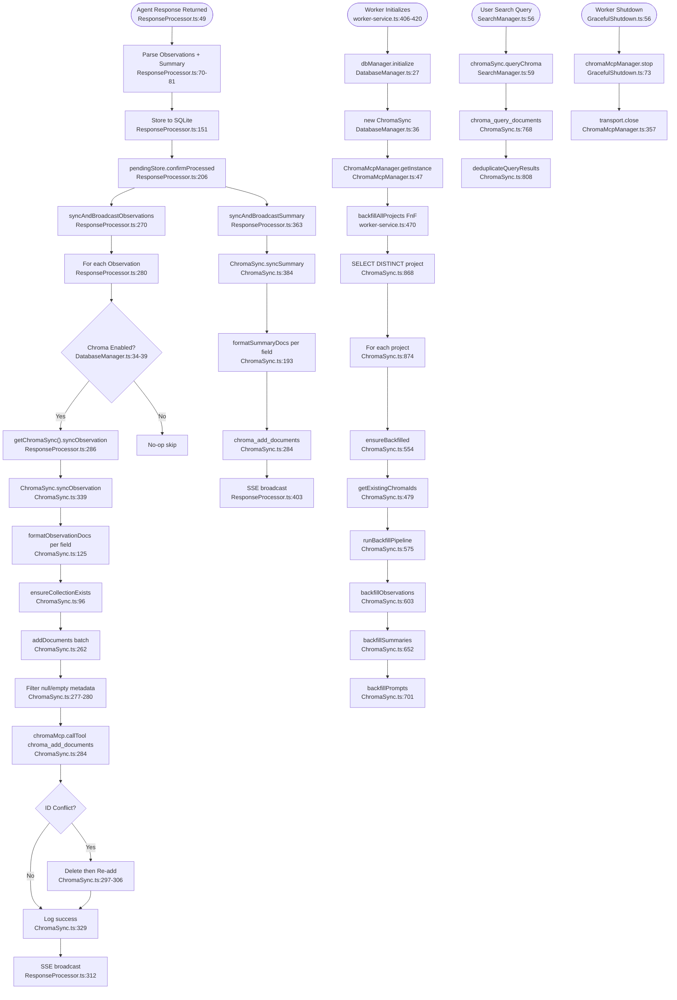

# Flowchart: vector-search-sync

## Sources Consulted
- `src/services/sync/ChromaSync.ts:1-969`
- `src/services/sync/ChromaMcpManager.ts:1-509`
- `src/services/worker/agents/ResponseProcessor.ts:1-423`
- `src/services/worker/DatabaseManager.ts:1-100`
- `src/services/worker-service.ts:1-550`
- `src/services/infrastructure/WorktreeAdoption.ts:1-348`
- `src/services/infrastructure/GracefulShutdown.ts:1-110`
- `src/services/worker/SearchManager.ts:1-100`

## Happy Path Description

When a new observation is stored to SQLite, ResponseProcessor orchestrates two fire-and-forget async paths in parallel: (1) Database write commits the observation row transactionally, then (2) ChromaSync is notified via `syncObservation()` to send formatted documents to Chroma via MCP. If Chroma is disabled (`CLAUDE_MEM_CHROMA_ENABLED=false`), sync is skipped. ChromaMcpManager maintains a persistent singleton stdio connection to the chroma-mcp Python subprocess with lazy initialization, auto-reconnect with backoff, and graceful shutdown.

On worker startup, `ChromaSync.backfillAllProjects()` runs fire-and-forget to detect missing observations by comparing Chroma's metadata index with SQLite. It batches in 100-document chunks, formats each observation into multiple granular documents (one per field), and syncs to per-project collections named `cm__<sanitized_project>`.

## Mermaid Flowchart

## Side Effects

- **MCP Connection**: Singleton stdio connection to chroma-mcp, lazy-init, reconnect with backoff, graceful shutdown.
- **Per-project collections**: `cm__<sanitized_project>` naming.
- **Granular vectorization**: Observations split into multiple docs per field (3-5× vector count).
- **Batch reconciliation**: Duplicate IDs handled via delete-then-add within batch.
- **Fire-and-forget**: All sync is non-blocking; failures log but don't block.
- **Worktree metadata patching**: `merged_into_project` stamp applied idempotently.

## External Feature Dependencies

**Calls into:**
- `chroma-mcp` Python subprocess (via stdio MCP protocol)
- ChromaMcpManager (singleton lifecycle)
- SQLite (source of truth for backfill)

**Called by:**
- ResponseProcessor (observation/summary sync after DB write)
- SearchManager (read-side Chroma queries)
- WorktreeAdoption (post-merge metadata updates)
- Worker lifecycle (startup backfill, shutdown)

## Confidence + Gaps

**High Confidence**: Single sync implementation; fire-and-forget pattern; per-project metadata-scoped collections; lazy MCP init.

**Medium Confidence**: Exact chroma-mcp tool names verified via grep.

**Gaps**: Embedding model config is inside chroma-mcp package (not this codebase); HNSW/ANN parameters not visible.
