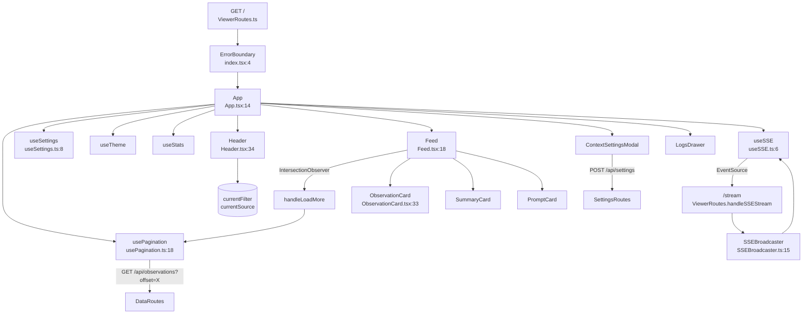

# Flowchart: viewer-ui-layer

## Sources Consulted
- `src/ui/viewer/App.tsx:1-162`
- `src/ui/viewer/index.tsx:1-16`
- `src/ui/viewer/hooks/useSSE.ts:1-147`
- `src/ui/viewer/hooks/useSettings.ts:1-80`
- `src/ui/viewer/hooks/usePagination.ts:1-80`
- `src/ui/viewer/types.ts:1-80`
- `src/ui/viewer/components/Header.tsx:1-60`
- `src/ui/viewer/components/Feed.tsx:1-60`
- `src/ui/viewer/components/ObservationCard.tsx:1-60`
- `src/ui/viewer/components/ErrorBoundary.tsx:1-63`
- `src/ui/viewer/components/ContextSettingsModal.tsx:1-60`
- `src/services/worker/SSEBroadcaster.ts:1-77`
- `src/services/worker/http/routes/ViewerRoutes.ts`

## Component Tree

1. ErrorBoundary (root)
2. App (orchestrator)
3. Header — project/source filters, SSE status, theme toggle
4. Feed — interleaved cards, infinite scroll via IntersectionObserver
5. ObservationCard / SummaryCard / PromptCard
6. ContextSettingsModal
7. LogsDrawer

## Happy Path Description

User loads `http://localhost:37777` → static viewer.html served → React mounts via `index.tsx` → `<ErrorBoundary><App/></ErrorBoundary>` → App initializes hooks (`useSSE`, `useSettings`, `useTheme`, `usePagination`, `useStats`) → `useSSE` opens `EventSource('/stream')` → backend emits `initial_load` with catalog → Header + Feed render → IntersectionObserver triggers `handleLoadMore` on scroll → `pagination.*.loadMore()` fetches `/api/observations?offset=X&limit=20` → merged with live SSE data in `useMemo` (deduped by `(project, id)`) → re-render. Real-time events (`new_observation`, `new_summary`, `new_prompt`) update state → re-render. Settings modal saves via `POST /api/settings`.

## Mermaid Flowchart

## State Management

Hooks + local state; no Redux/Zustand/Context store.

- `useSSE`: observations, summaries, prompts, catalog, isConnected, isProcessing, queueDepth. EventSource events update.
- `useSettings`: settings object, isSaving, saveStatus.
- `usePagination`: per-datatype isLoading, hasMore, offsetRef, lastSelectionRef. Resets offset on filter change.
- `useTheme`: preference, applies to DOM.
- `useStats`: stats fetched once.
- App local: `currentFilter`, `currentSource`, `contextPreviewOpen`, `logsModalOpen`, `paginatedObservations/Summaries/Prompts`.

**Duplication note:** Observations live in both `useSSE().observations` (live) and App's `paginatedObservations` (older chunks). Merged in `useMemo` with `(project, id)` dedup.

## Side Effects

- EventSource auto-reconnect on error after `TIMING.SSE_RECONNECT_DELAY_MS`.
- IntersectionObserver setup/cleanup per Feed mount.
- Fetch settings + stats on mount.
- DOM theme attribute mutation.

## External Feature Dependencies

**Consumes:** SSEBroadcaster (backend SSE), DataRoutes (pagination), SettingsRoutes (config), SessionStore (catalog on init).

## Confidence + Gaps

**High:** SSE flow; hook composition; pagination; state merging.

**Medium:** Exact paginated response shape; catalog-update strategy (additive only).

**Gaps:** CSS layer; `TerminalPreview`, `ThemeToggle`, `GitHubStarsButton`; full LogsModal console capture; saveSettings error branch.
