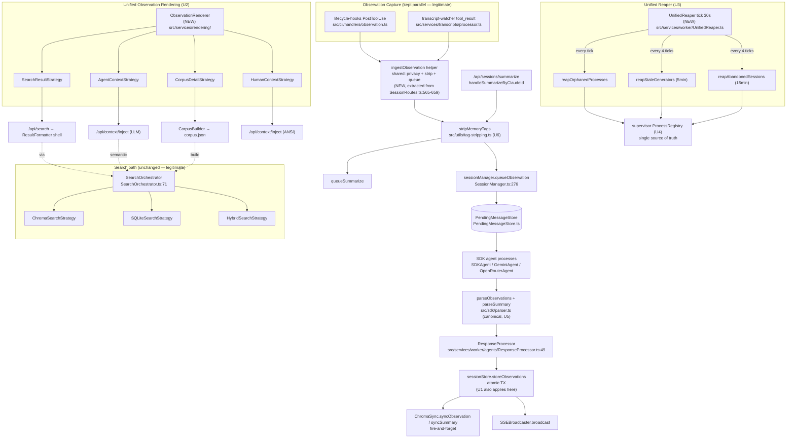

# Pathfinder Phase 3: Unified Architecture Proposal

**Date**: 2026-04-21
**Scope**: 8 unification targets derived from Phase 2 findings. Only accidental duplications — legitimate specializations are preserved untouched.

**Design principle**: Prefer deletion over abstraction. Prefer one path over configurable paths. If the simplest fix is "move the call site," do that instead of building a registry.

---

## U1. Close the Privacy-Stripping Summary Gap

**Current state**: `src/utils/tag-stripping.ts` exports `stripTagsInternal()` (all 6 tags) used at `SessionRoutes.ts:862` (user prompts) and `SessionRoutes.ts:629/633` (tool I/O). The summary-ingest path receives assistant messages stripped only of `<system-reminder>` (via `SYSTEM_REMINDER_REGEX` in `transcript-parser.ts:84` / `summarize.ts:66`), then queues them without a full-suite strip at `SessionRoutes.handleSummarizeByClaudeId:669+705`.

**Result**: `<private>`, `<claude-mem-context>`, `<system_instruction>`, `<persisted-output>` tags can reach `session_summaries` rows.

**Unified design**:
- Single entry point: `stripMemoryTags(content)` in `src/utils/tag-stripping.ts` (remove the two wrapper functions `stripMemoryTagsFromPrompt` / `stripMemoryTagsFromJson` — they already call the same internal function).
- Call `stripMemoryTags(last_assistant_message)` at `SessionRoutes.ts:~680` (inside `handleSummarizeByClaudeId`, before `queueSummarize`). This is a **three-line fix**.

**Replaces**:
- `src/utils/tag-stripping.ts:79-91` (delete both wrapper function exports, update 3 call sites to new name)
- Adds one call in `SessionRoutes.ts:~680`

**What's lost**: Nothing. No behavior change for non-summary paths.

---

## U2. Unified Observation Renderer

**Current state**: Three independent renderers produce markdown from observations:

| File | Audience | Shape |
|---|---|---|
| `src/services/worker/search/ResultFormatter.ts:25-200` | CLI search results | Compact tables grouped by date/file |
| `src/services/context/formatters/AgentFormatter.ts:36-200` | Session context injection | One-line-per-observation for LLM tokens |
| `src/services/context/formatters/HumanFormatter.ts:35-238` | Terminal context display | ANSI-colored human-readable |
| `src/services/worker/knowledge/CorpusRenderer.ts:14-133` | Agent priming corpus | Full-detail narrative sections |

Each independently looks up type icon (via ModeManager), computes tokens, formats title/subtitle, walks facts/concepts. ~600 lines of overlapping traversal.

**Unified design**: New `src/services/rendering/ObservationRenderer.ts` base with pluggable strategy:

```
ObservationRenderer {
  // shared: type-icon lookup, token estimation, time formatting, facts/concepts walk
  renderObservation(obs, strategy: RenderStrategy): string
}

RenderStrategy interface:
  headerLine(obs) → string
  detailLines(obs) → string[]
  footerLine(obs) → string
  groupingMode: 'date-file' | 'day-timeline' | 'none'
```

Concrete strategies:
- `SearchResultStrategy` (replaces ResultFormatter row-level logic)
- `AgentContextStrategy` (replaces AgentFormatter row-level logic)
- `HumanContextStrategy` (replaces HumanFormatter row-level logic)
- `CorpusDetailStrategy` (replaces CorpusRenderer row-level logic)

Shared grouping stays in `timeline-formatting.ts` utility (already exists).

**Replaces**:
- Traversal code in `ResultFormatter.ts:115-200`, `AgentFormatter.ts:86-137`, `HumanFormatter.ts:80-238`, `CorpusRenderer.ts:39-85`
- Keeps the four callers as thin wrappers that build a strategy and invoke the renderer.

**What's lost**: Nothing. Same outputs, one traversal.

**Anti-pattern to reject**: Do NOT build a plugin registry or factory. Four concrete strategy objects are sufficient — a simple switch or direct construction at call sites is fine.

---

## U3. Unified Reaper

**Current state**: Two independent timers with overlapping lifecycle concerns:

| Timer | Interval | Concern | Location |
|---|---|---|---|
| `staleSessionReaperInterval` | 2 min | reapStaleSessions (5-min stuck generators, 15-min stale sessions) | `worker-service.ts:547` |
| `startOrphanReaper` | 30 s | Dead-session PIDs, system orphans (ppid=1), idle daemon children | `ProcessRegistry.ts:508` |

The T32 observation notes explicitly state this unification was planned but not implemented. `reapStaleSessions` is distinct session-lifecycle logic; the orphan reaper is process-lifecycle only.

**Unified design**: `src/services/worker/UnifiedReaper.ts` with a single `setInterval` ticking every 30s. Each tick runs three checks **in order**, each skippable if its cooldown hasn't elapsed:

```
UnifiedReaper tick @30s:
  1. reapOrphanedProcesses()    — every tick (30s)
  2. reapStaleGenerators()      — every 4 ticks (2 min)
  3. reapAbandonedSessions()    — every 4 ticks (2 min, 15-min threshold)
```

Move `reapStaleSessions` body out of SessionManager into UnifiedReaper; keep `detectStaleGenerator` helper on SessionManager (session-owned logic).

**Replaces**:
- Delete `staleSessionReaperInterval` setup + teardown at `worker-service.ts:547, 1108-1110`
- Delete `startOrphanReaper` at `ProcessRegistry.ts:508`
- Delete `reapStaleSessions` body at `SessionManager.ts:516-568`
- Wire new `UnifiedReaper` into worker startup/shutdown

**What's lost**: Nothing functionally. The 30s orphan-reap cadence is preserved; the 2-min session cadence is preserved; call sites unify to one timer handle.

**Anti-pattern to reject**: Do NOT parameterize each check with its own separate timer. The point is ONE timer.

---

## U4. Single Process Registry

**Current state**:
- `src/services/worker/ProcessRegistry.ts` (528 lines) — worker-level facade. Delegates to supervisor via `getSupervisor().getRegistry()` for actual state.
- `src/supervisor/process-registry.ts` (409 lines) — supervisor-level persistent registry (supervisor.json).

The worker facade duplicates API surface (`registerProcess`, `unregisterProcess`, `getAll`, `getByPid`) but adds the spawn-wrapping helpers (`createPidCapturingSpawn`, `ensureProcessExit`).

**Unified design**: Keep `src/supervisor/process-registry.ts` as the sole registry. Move the spawn-wrapping helpers (the parts that DO add value) into `src/services/worker/process-spawning.ts` as plain functions, not another class. Delete `src/services/worker/ProcessRegistry.ts` and update imports to hit the supervisor registry directly.

**Replaces**:
- Delete `src/services/worker/ProcessRegistry.ts`
- Extract spawn helpers to `src/services/worker/process-spawning.ts`
- Update ~15 import sites to use `getSupervisor().getRegistry()` directly

**What's lost**: A layer of indirection that was mostly pass-through.

**Anti-pattern to reject**: Do NOT replace the worker facade with a "simpler worker facade." Just delete it.

---

## U5. Canonical XML Parser

**Current state**:
- `src/sdk/parser.ts` — canonical `parseObservations` + `parseSummary` with ModeManager type validation.
- `src/bin/import-xml-observations.ts:162` — parallel `parseSummary` for CLI import, missing type validation.

**Unified design**: Delete the inline parser in `import-xml-observations.ts` and call `parseSummary` from `src/sdk/parser.ts`. Pass an option flag to skip type validation if the import tool genuinely needs that (likely it doesn't — historical observations should still validate).

**Replaces**:
- `src/bin/import-xml-observations.ts:162` (delete ~40 lines; replace with import)

**What's lost**: Potentially: ability to import observations with types not currently in ModeManager. If that's actually needed, add `parseSummary(text, { strict: false })` option.

---

## U6. Single `stripMemoryTags` Export

**Current state**: `src/utils/tag-stripping.ts` exports three functions: `stripTagsInternal` (internal), `stripMemoryTagsFromPrompt` (wrapper), `stripMemoryTagsFromJson` (wrapper). The two public wrappers are identical.

**Unified design**: Keep `stripMemoryTags(content: string)` as the single public export. Remove the two wrappers. Update 3 call sites in SessionRoutes to new name.

**Replaces**:
- Delete `stripMemoryTagsFromPrompt` and `stripMemoryTagsFromJson` at `src/utils/tag-stripping.ts:79-91`
- Update `SessionRoutes.ts:629, 633, 862` (plus U1's new call at ~680)

**What's lost**: Nothing. Pure rename/deletion.

---

## U7. Remove SearchManager Legacy Methods

**Current state**: `src/services/worker/SearchManager.ts` retains private `@deprecated` methods (`queryChroma`, `searchChromaForTimeline`) that were superseded by SearchOrchestrator strategies.

**Unified design**: Delete the deprecated private methods. If any external caller exists (unlikely), update to use SearchOrchestrator directly.

**Replaces**: Dead code removal only.

**What's lost**: Nothing — these are flagged deprecated.

---

## U8. Transcript-Watcher Direct Queue

**Current state**: `src/services/transcripts/processor.ts:240-244` calls `observationHandler.execute()` which then POSTs to `/api/sessions/observations`, which calls `sessionManager.queueObservation()`. The HTTP loopback adds latency and an extra JSON round-trip for a same-process call.

**Unified design**: Have the transcript processor call `sessionManager.queueObservation()` directly (same as `SessionRoutes` does after validation). Move the privacy-check and tag-strip logic currently in `SessionRoutes.handleObservationsByClaudeId` into a shared helper `ingestObservation(payload)` that both SessionRoutes and TranscriptProcessor call.

**Replaces**:
- `src/services/transcripts/processor.ts:240-244` (skip observationHandler hop)
- Extract `ingestObservation` helper from `SessionRoutes.ts:565-659`

**What's lost**: Minor — the observationHandler's `isProjectExcluded` check runs in both paths; the extracted helper handles both.

---

## Combined Unified Flowchart



## Summary of Deletions

| Target | Lines removed (approx) |
|---|---|
| `stripMemoryTagsFromPrompt`/`stripMemoryTagsFromJson` wrappers | 20 |
| `src/bin/import-xml-observations.ts` inline parser | 40 |
| `src/services/worker/ProcessRegistry.ts` (mostly) | 400 |
| `staleSessionReaperInterval` + `startOrphanReaper` + `reapStaleSessions` (moved, not net-new) | 0 net (re-homed) |
| SearchManager `@deprecated` methods | 60 |
| ResultFormatter/AgentFormatter/HumanFormatter/CorpusRenderer traversal duplication | ~400 |
| **Total net deletion estimate** | **~900 lines** |

## Summary of Additions

| Addition | Lines (estimate) |
|---|---|
| `src/services/rendering/ObservationRenderer.ts` + 4 strategy files | ~300 |
| `src/services/worker/UnifiedReaper.ts` | ~120 |
| `src/services/worker/process-spawning.ts` (extracted helpers) | ~150 |
| `ingestObservation` helper | ~60 |
| **Total additions** | **~630 lines** |

**Net**: ~270 lines removed, surface area significantly reduced, security gap closed.
