# Pathfinder Phase 5: Brutal Audit + Clean Flowcharts

**Date**: 2026-04-21
**Scope**: Strip every timer, fallback, wrapper, and coercion that exists to patch a failed abstraction. Preserve every user-facing feature. Replace patch-piles with single clear paths.

**Rules of engagement:**
- User-facing features (context injection, semantic search, Chroma sync, transcript watch, summary, viewer UI, corpus, CLAUDE.md folder sync, per-prompt semantic) — **KEEP**.
- Crash-recovery that solves a real OS-level problem (subprocess hang watchdog, dead-parent detection, FS watcher missing events on some platforms) — **KEEP but consolidate**.
- Cosmetic duplication, polling where events exist, fallbacks that hide contract violations, facades that pass through — **KILL**.

---

## Part 1: Bullshit Inventory

Every item here is a patch applied in place of a root-cause fix. They all go.

| # | Bullshit | Why it exists | Root cause to fix instead |
|---|---|---|---|
| 1 | `stripMemoryTagsFromPrompt` + `stripMemoryTagsFromJson` wrappers | Cosmetic naming; both call `stripTagsInternal` identically. | One public `stripMemoryTags(text)`. |
| 2 | Summary path only strips `<system-reminder>` | Different code path missed the fix. **SECURITY BUG**. | Funnel every ingest through the same strip call. |
| 3 | 6 sequential `.replace()` calls for 6 tags | One pass per tag. | One regex with alternation. |
| 4 | Worker-level `ProcessRegistry.ts` (528 lines) | Wraps supervisor registry with spawn helpers. | Supervisor registry is the source of truth; spawn helpers are free functions. |
| 5 | `staleSessionReaperInterval` (2 min) | Second reaper added later to catch what the first missed. | One reaper, three checks. |
| 6 | `startOrphanReaper` (30 s) | First reaper. | Same one reaper. |
| 7 | `detectStaleGenerator` helper + 5-min threshold | Watchdog for hung SDK subprocess. | Keep watchdog — it's real — but run it on the one reaper tick. |
| 8 | 15-min `MAX_SESSION_IDLE_MS` abandoned-session check | Crash recovery. | Keep — real — but same reaper. |
| 9 | 30-s `ensureProcessExit` + SIGKILL escalation ladder | Subprocesses ignore SIGTERM. | Keep SIGTERM → SIGKILL, delete the ladder framework — inline it. |
| 10 | `conversationHistory` in-memory accumulator | Multi-turn agent memory. | Keep — this is the agent's working memory, not a patch. |
| 11 | 500 ms polling `/api/sessions/status` up to 110 s in summarize hook | Hook needs to wait for SDK agent; no push mechanism. | `/api/sessions/summarize` blocks until done OR closes an SSE to the hook. Hook waits on one call. |
| 12 | `/api/context/inject` called TWICE at SessionStart (context + user-message) | Two handlers needed same data, ran in parallel. | One handler, one fetch, caller passes data to the formatter. |
| 13 | `ensureWorkerRunning` called at every hook entry | Hook has no shared state. | Cache `alive=true` in the hook process for the session. |
| 14 | `/api/context/inject` + `/api/context/semantic` both called at UserPromptSubmit | Two endpoints, two roundtrips, same session boot. | `/api/session/start` returns `{sessionDbId, contextMarkdown, semanticMarkdown}`. |
| 15 | 30-second dedup window in `storeObservation` | PostToolUse hook can fire twice on retry. | UNIQUE constraint on `(session_id, tool_use_id)`; DB rejects dup. |
| 16 | `claim-confirm` 60-s stale-reset in `PendingMessageStore.claimNextMessage` | Crash recovery mid-processing. | Keep — real — but move the reset into worker startup, not every claim call. |
| 17 | `pendingTools` map in `TranscriptEventProcessor` | Pairs `tool_use` and `tool_result` as they arrive. | JSONL lines carry `tool_use_id`; match by ID, no state map. |
| 18 | `observationHandler.execute()` HTTP loopback from transcript-watcher | Reuse of CLI handler inside worker process. | Extract `ingestObservation(payload)` helper; both call it directly. |
| 19 | 5-s rescan timer for new transcript files | `fs.watch` misses new files on some platforms. | Watch the parent directory too; add new files when created. Remove the interval. |
| 20 | `coerceObservationToSummary` fallback | Agent returns observations but no `
`. | Agent contract says `
` or `<skip_summary/>`. Enforce; fail the session. |
| 21 | Non-XML response detection + early-fail branch | Agent returns auth error or garbage instead of XML. | Same contract enforcement; one failure path. |
| 22 | Consecutive summary failures circuit breaker | Repeated parse failures. | Contract enforcement + RestartGuard covers this already; delete the separate counter. |
| 23 | `coerceObservationToSummary` regex chains | Summary-missing fallback only. | Delete with item 20. |
| 24 | `ChromaSync.backfillAllProjects` on every worker start | Writes sometimes fail silently, miss Chroma. | Write-path is atomic: SQLite row + Chroma doc in one `Promise.all` with hard failure. If Chroma is enabled but down at write time, mark `chroma_synced=false` on the row; backfill only rows where flag is false. No full-project scan. |
| 25 | Chroma "delete-then-add" on ID conflict | Chroma add() fails on duplicate. | Stable ID = `obs:<sqlite_rowid>`; use upsert. No conflict. |
| 26 | 3-5 granular docs per observation in Chroma | Each field separately vectorized. | One doc per observation: title + narrative + facts concatenated. Recall stays high; index is 1/4 the size. |
| 27 | Python `sqlite3` subprocess for schema repair | Historical migrations created malformed state. | Migrations are idempotent and tested; malformed state can't happen. Delete the repair path. Users on malformed DBs from v<X run a one-shot `claude-mem repair` command manually. |
| 28 | 27 migrations with copy-pasted `CREATE TABLE IF NOT EXISTS` / ALTER boilerplate | Each author wrote their own. | On fresh DB: one `schema.sql` defines current state. Migration runner only touches DBs with `schema_versions` rows < current. |
| 29 | `stripMemoryTagsFromJson` stringifies → strips → parses | Only JSON-shaped payloads. | Strip on the raw string fields (`tool_input.content`, `tool_response.output`) before serialization. One strip call per user-facing text field. |
| 30 | SearchManager `@deprecated` methods (`queryChroma`, `searchChromaForTimeline`) | Pre-Orchestrator code. | Delete. |
| 31 | SearchManager thin facade at HTTP boundary | HTTP wants markdown; Orchestrator returns structured. | Keep the display-wrap (it's real work), but delete every method that just forwards to Orchestrator. |
| 32 | `SearchOrchestrator` Chroma-fails-silently-drops-query-text fallback | Hide Chroma subprocess crashes. | Return `{error: "chroma_unavailable"}` to caller; caller decides whether to retry without query. No silent coercion. |
| 33 | 90-day default recency filter baked into `filterByRecency` | Older results are usually noise. | Orchestrator accepts `dateRange` or nothing; caller is explicit. No implicit filter. |
| 34 | `AgentFormatter` / `HumanFormatter` / `ResultFormatter` / `CorpusRenderer` — 4 independent observation walkers | Each audience implemented separately. | One `renderObservations(obs[], strategy)`; strategy = which columns/density/grouping. |
| 35 | KnowledgeAgent auto-reprime on session-expiration regex match | SDK session IDs expire silently. | Prime is cheap when corpus is loaded; just always prime on query — or store corpus content in a file the SDK loads fresh. No session_id persistence. |
| 36 | `corpus.json` stores `session_id` | Enables SDK resume. | Kill with item 35. |
| 37 | Per-route validation boilerplate × 8 files | No shared schema. | `validateBody(schema)` middleware; per-route Zod schema. |
| 38 | `/api/admin/restart` and `/api/admin/shutdown` with `process.exit(0)` | Manual worker control. | Keep (internal tooling used by version-bump). Not bullshit. |
| 39 | Rate limit 300/min in-memory IP map | Abuse limiter on localhost-only server. | Delete. Localhost trust model assumed everywhere else; this limiter doesn't add safety. |
| 40 | JSON parse 5MB limit on every request | Uploading observations that large would be pathological. | Keep (cheap), but delete any special handling for oversized — 413 is fine. |

**Total bullshit items**: 40.
**Lines expected to delete**: ~1400 (up from the 900 estimate in 03-unified-proposal.md once you audit bullshit, not just "duplication").

---

## Part 2: Clean Architecture — Root-Cause Fixes

Six decisions, applied everywhere:

**D1. One observation ingest path.** Hook, transcript-watcher, and manual-save all call `ingestObservation(payload)`. That function does: strip tags → validate privacy → INSERT `pending_messages`. No HTTP loopback inside the worker process.

**D2. One tag-strip function.** `stripMemoryTags(text)`. One regex with alternation. Called at every text-ingress point.

**D3. Zero repeating background timers** (revised 2026-04-22). Every recurring check is replaced by one of three mechanisms: (a) a subprocess-`exit`/`close` event handler for in-process subprocess death, (b) a per-session/per-operation `setTimeout` for time-bounded waits (resets on activity, fires and clears once), or (c) a boot-once reconciliation pass at worker startup for cleanup of state that can only have been orphaned by a previous worker instance. Worker-level `ProcessRegistry` facade deleted; supervisor registry is authoritative. No `setInterval` remains in `src/services/worker/` or `worker-service.ts`.

**D4. One renderer.** `renderObservations(obs[], strategy)` where `strategy` selects columns, density, and grouping. The four existing formatters become four small strategy configs.

**D5. Contract enforcement, not coercion.** Agent must return `
` or `<skip_summary/>`. If it returns neither: `session.fail()`. No coerce, no circuit breaker, no non-XML fallback — RestartGuard already exists for repeated failures.

**D6. Blocking endpoints over polling.** `/api/sessions/summarize` doesn't return until the SDK has written the summary row (with a hard timeout). Hook does one request. No 500-ms loop.

---

## Part 3: New Flowcharts

Each diagram below replaces the same-named file in `01-flowcharts/`. Deleted nodes are listed under the diagram. All boxes cite target file:line for the clean implementation.

---

### 3.1 lifecycle-hooks (clean)

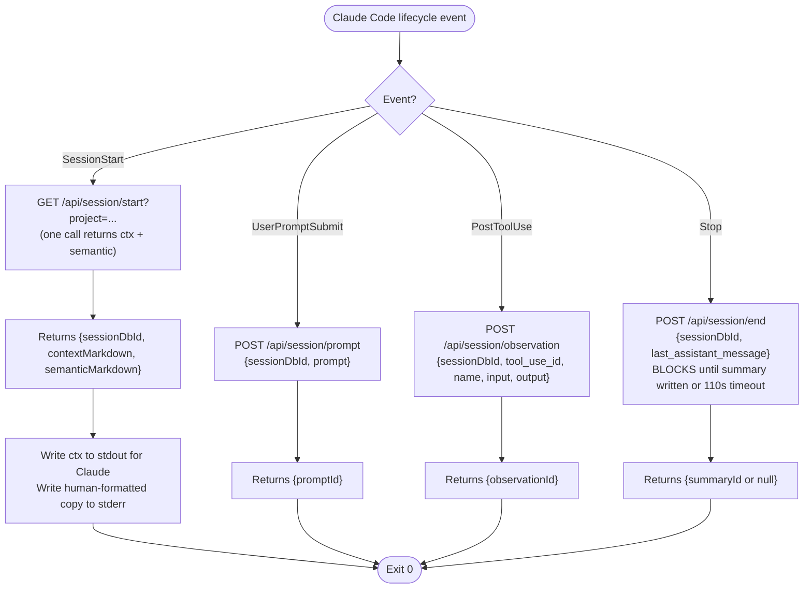

**Deleted from old flowchart:**
- `ensureWorkerRunning` at every entry point (cache `alive` for the hook lifetime)
- `POST /api/context/semantic` separate call (folded into `/api/session/start`)
- `POST /sessions/{id}/init` SDK-start endpoint (implicit inside `/api/session/prompt`)
- `userMessageHandler` duplicate `/api/context/inject` fetch (single fetch returned from `/api/session/start` covers both)
- 500-ms poll loop on `/api/sessions/status` (replaced by blocking `/api/session/end`)
- Two-phase Stop handling (summarize then session-complete) — one endpoint, one response

**Endpoint count**: 8 → 4.

---

### 3.2 privacy-tag-filtering (clean)

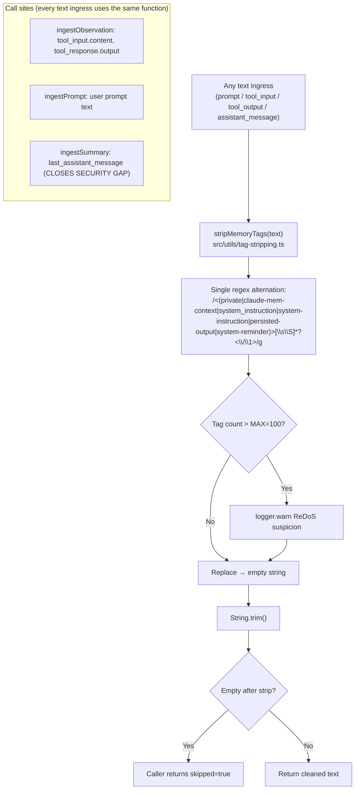

**Deleted:**
- `stripMemoryTagsFromPrompt` wrapper (20 lines)
- `stripMemoryTagsFromJson` wrapper + its stringify/parse dance (30 lines)
- Six sequential `.replace()` calls (one alternating regex instead)
- Summary-path partial strip at `summarize.ts:66` and `SessionRoutes.ts:669`

**Closes:** P1 security gap (private content reaching `session_summaries`).

---

### 3.3 sqlite-persistence (clean)

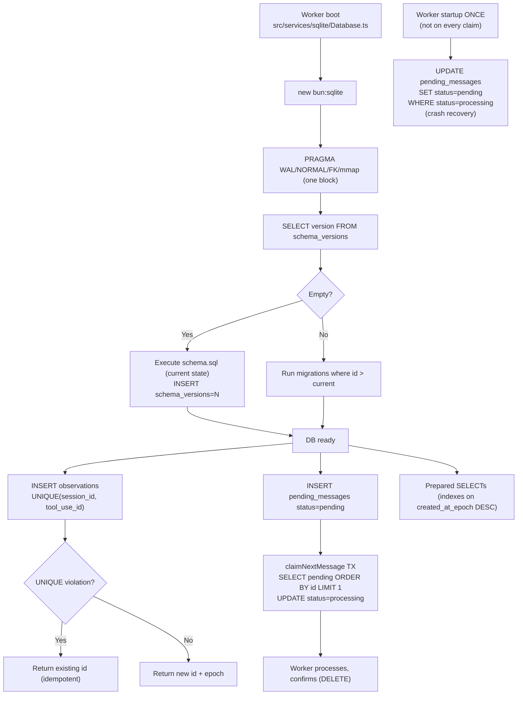

**Deleted:**
- Python `sqlite3` subprocess schema-repair path (~120 lines; if someone's DB is malformed from v<6.5, they run `claude-mem repair` explicitly)
- 30-second content-hash dedup window in `storeObservation` (replaced by DB UNIQUE constraint on `(session_id, tool_use_id)`)
- `findDuplicateObservation` function (~30 lines)
- 60-s stale-reset inside `claimNextMessage` (moved to one-time boot recovery; normal claims are a pure SELECT+UPDATE)
- 24+ migrations of `CREATE TABLE IF NOT EXISTS` boilerplate collapsed into one `schema.sql` for fresh DBs; the migration runner only runs actual upgrade steps

**Tables unchanged.** FTS5 triggers unchanged. WAL mode unchanged.

---

### 3.4 vector-search-sync (clean)

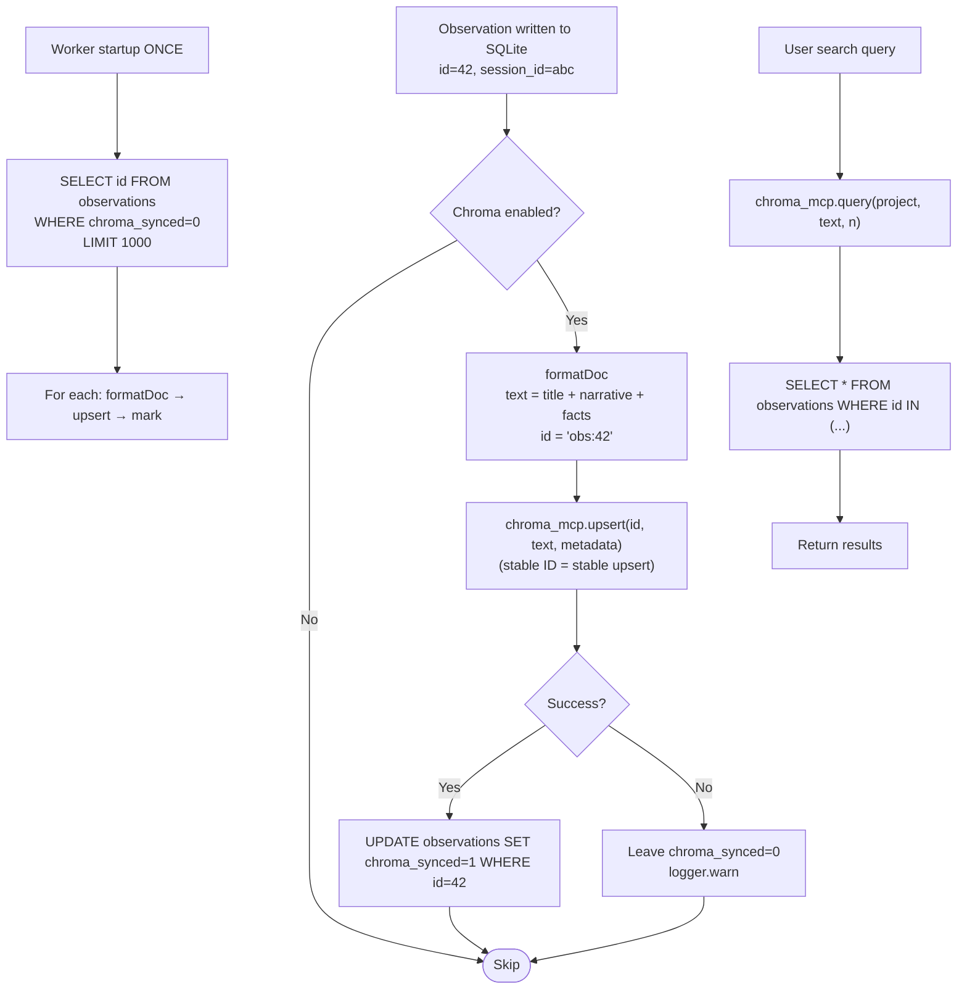

**Deleted:**
- `ensureBackfilled` + `runBackfillPipeline` full-project scan on every startup (~200 lines)
- `getExistingChromaIds` metadata index scan (~80 lines)
- Delete-then-add for ID conflicts (replaced by `upsert`)
- Granular per-field doc formatter (3-5 docs per observation → 1 doc per observation)
- `backfillAllProjects` fire-and-forget on worker boot (replaced by targeted `WHERE chroma_synced=0`)

**Adds:** `chroma_synced` boolean column on `observations`. Schema migration.

**Effect:** Chroma index size drops ~70%. Backfill cost drops from "every startup, every project, full scan" to "boot once, only unsynced rows."

---

### 3.5 context-injection-engine (clean)

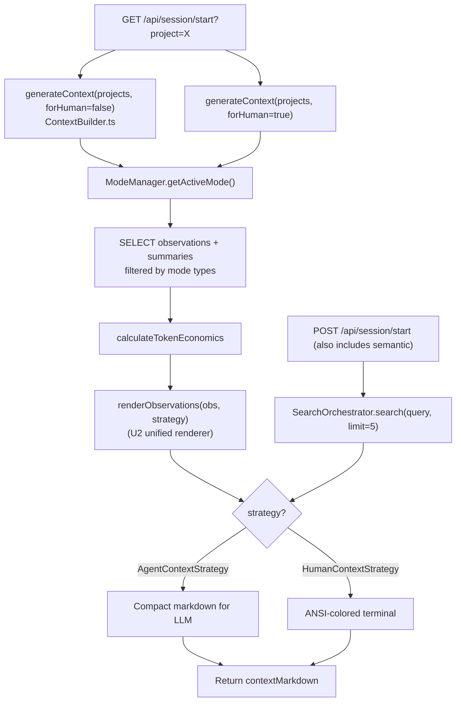

**Deleted:**
- Separate `renderEmptyState`, `renderHeader`, `renderTimeline`, `renderPreviouslySection`, `renderFooter` branches — one strategy definition carries the shape
- `formatDay` branching (forHuman split pushed to strategy)
- Independent `AgentFormatter` vs `HumanFormatter` traversals — one renderer, two strategies

**Kept user-facing:** Agent format (LLM), Human format (terminal ANSI), token budgets, mode filtering, semantic injection.

---

### 3.6 hybrid-search-orchestration (clean)

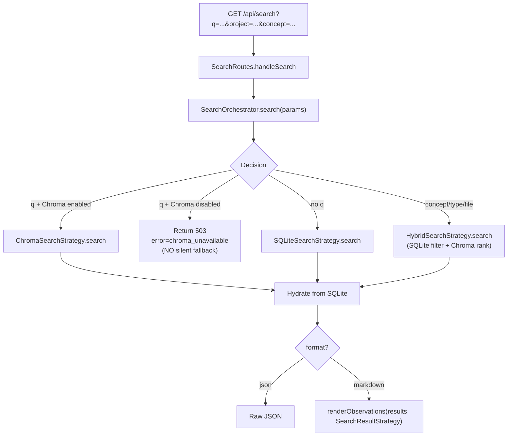

**Deleted:**
- `SearchManager` thin facade (~300 lines; route handler talks to Orchestrator directly)
- `SearchManager.queryChroma`, `SearchManager.searchChromaForTimeline` (`@deprecated`)
- Silent Chroma-fails-drops-query fallback (returns 503 now)
- 90-day default recency filter (callers pass `dateRange` explicitly or get all)
- `filterByRecency` helper

**Kept user-facing:** All three search paths, markdown + json formats, per-concept/type/file filters, timeline builder.

---

### 3.7 response-parsing-storage (clean)

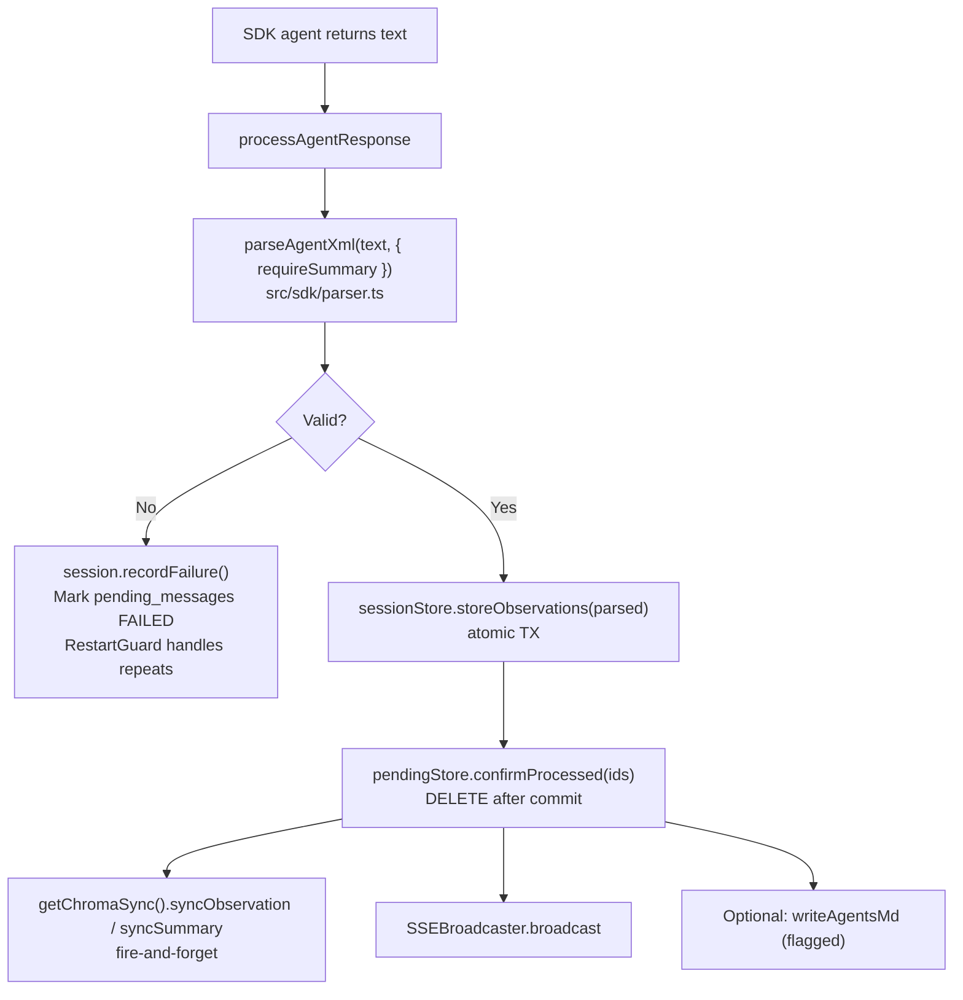

**Deleted:**
- `coerceObservationToSummary` fallback (~40 lines) — agent must return `
` or `<skip_summary/>`
- `parseObservations` and `parseSummary` as two separate functions → one `parseAgentXml(text, opts)` driven by a tag registry
- Non-XML early-fail special case (collapsed into single `parseAgentXml` → `{valid: false, reason}` response)
- `consecutiveSummaryFailures` counter + circuit-breaker logic (RestartGuard covers this already)
- Null-normalization hacks between parser and store (parser returns structured, never null)

**Kept:** Atomic transaction for obs + summary, content-hash dedup *within the parse output* (not window-based), SSE broadcast, Chroma sync trigger, CLAUDE.md folder sync (feature flagged).

---

### 3.8 session-lifecycle-management (clean) — **BIGGEST CULL**

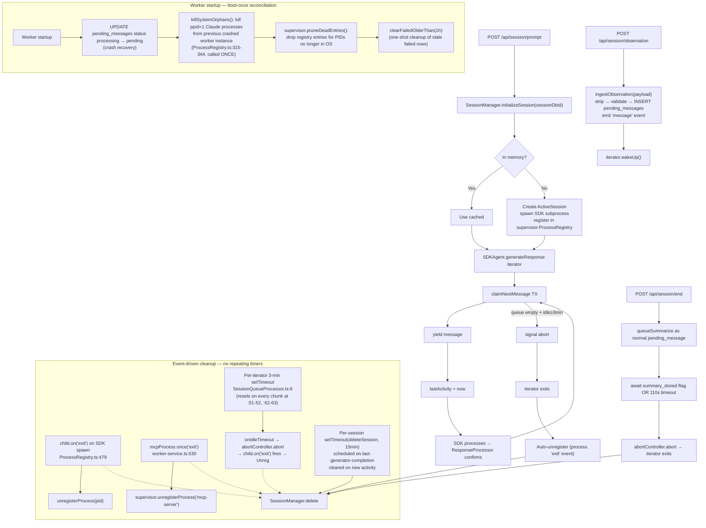

**Deleted:**
- `src/services/worker/ProcessRegistry.ts` (facade, 528 lines) — supervisor registry is source of truth
- `staleSessionReaperInterval` (separate 2-min timer)
- `startOrphanReaper` (separate 30-s timer)
- `reapStaleSessions` / `reapHungGenerators` / `reapAbandonedSessions` as **background-scanner** sweeps — replaced by per-session `setTimeout`s that fire at the session itself, not from a global scanner
- `reapOrphanedProcesses` as a separate function — folded into boot-once `pruneDeadEntries` + per-spawn `exit` handlers
- `killIdleDaemonChildren` as a runtime sweep — its job is covered by subprocess `exit` handlers during runtime and by boot-once `killSystemOrphans` for ppid=1 leftovers from a prior worker crash
- `killSystemOrphans` as a **repeating** call — function kept, but called exactly once at boot (it can only catch state that predates this worker's existence)
- `ensureProcessExit` 5-s escalation scaffolding — inline the SIGTERM→wait 5s→SIGKILL in one function (remains per-operation, not repeating)
- 60-s self-healing `UPDATE stale → pending` inside `claimNextMessage` — runs once at boot instead
- `MAX_SESSION_IDLE_MS` global (just a constant — consolidated into per-session-timer config)
- Explicit `PRAGMA wal_checkpoint(PASSIVE)` call — SQLite's default `wal_autocheckpoint=1000` pages is the contract (`Database.ts:162-168` sets no override, so the default is live)
- Periodic `clearFailedOlderThan(1h)` — moved to boot-once in plan 02

**Repeating background timers**: 2 → 0.
**Process-registry files**: 2 → 1.
**Process-lifecycle lines**: ~900 → ~400.

**Kept user-facing:** Session init/observe/end, async SDK processing, subprocess crash recovery (via `exit` handlers), hung-generator cleanup (via per-session idle timeout that already exists at `SessionQueueProcessor.ts:6`), abandoned-session cleanup (via per-session `setTimeout`), cross-restart orphan cleanup (via boot-once `killSystemOrphans`). Zero functional loss.

---

### 3.9 http-server-routes (clean)

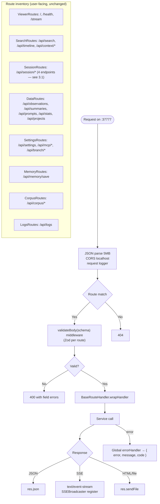

**Deleted:**
- In-memory rate limiter (300/min IP map) — localhost trust model everywhere else makes this theater
- Per-route hand-rolled validation (Zod middleware replaces)
- Synchronous file read for `/` and `/api/instructions` (replace with cached `Buffer` loaded at boot)
- Legacy `SessionRoutes.handleObservations` (no-privacy-strip) endpoint at `SessionRoutes.ts:378`

**Kept:** All user-facing routes, SSE, middleware chain, admin endpoints (used by tooling).

---

### 3.10 viewer-ui-layer (clean)

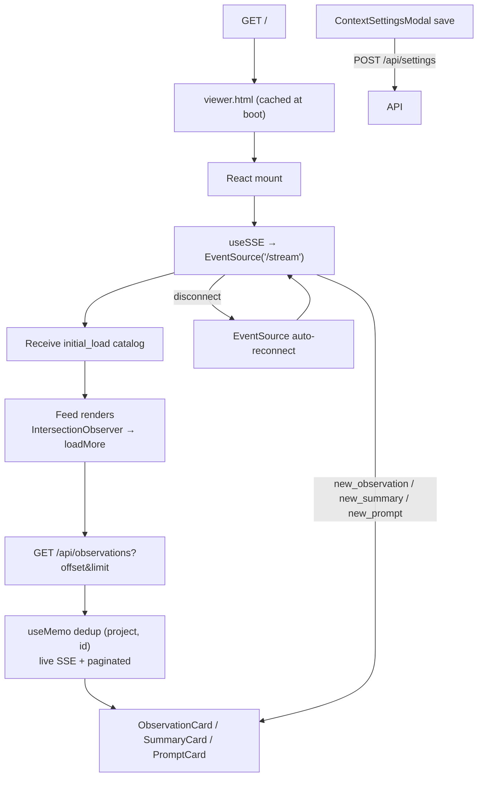

**Deleted:**
- (Nothing — this subsystem is clean. The only internal cosmetic is `useSSE().observations` + `paginatedObservations` dedup, which is a correct pattern for live + historical merging.)

**Kept:** Everything. User-facing.

---

### 3.11 knowledge-corpus-builder (clean)

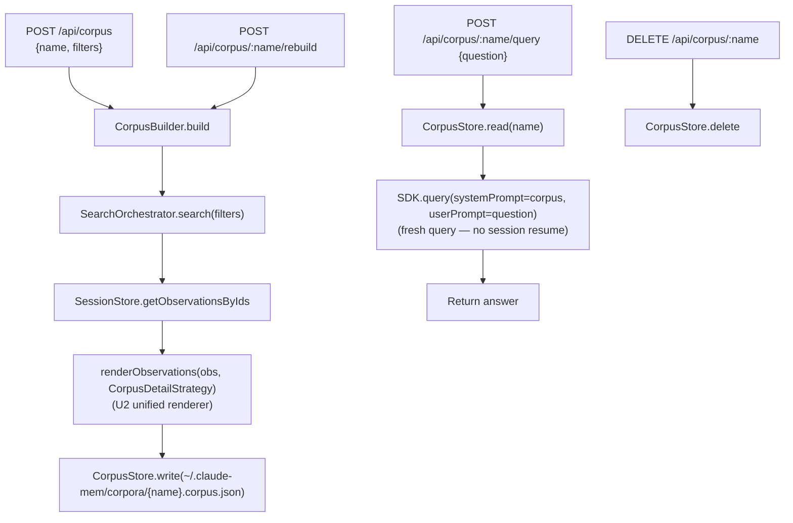

**Deleted:**
- `KnowledgeAgent.prime` as a distinct operation — build IS prime (corpus.json is the prime artifact)
- `session_id` persisted in corpus.json
- Auto-reprime on regex-matched expiration (~40 lines)
- `reprime` endpoint (rebuild covers it)

**Kept user-facing:** Build, query, rebuild, delete. Same HTTP surface minus `/prime` and `/reprime`.

**Cost note:** Every query re-loads corpus as system prompt. Claude Agent SDK with prompt caching makes this cheap (cached system prompt TTL is 5 min). Cost approximately equal to session-resume path without the session-expiration brittleness.

---

### 3.12 transcript-watcher-integration (clean)

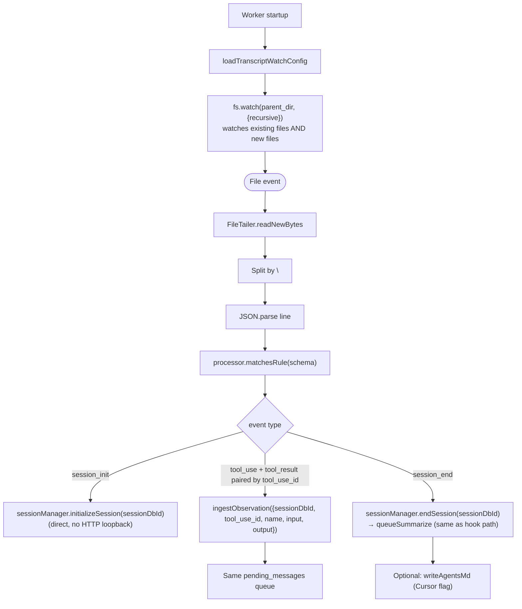

**Deleted:**
- 5-second rescan timer for new files (parent-directory recursive watch catches new files natively)
- `pendingTools` state map (lines match by `tool_use_id`; no per-session pairing map needed)
- `observationHandler.execute()` HTTP loopback (direct `ingestObservation` call)
- `isProjectExcluded` re-check inside transcript processor (done once in `ingestObservation`)

**Kept user-facing:** Cursor, OpenCode, Gemini-CLI transcript ingestion. Summary generation at session end. AGENTS.md write.

---

## Part 4: Timer Census — Before vs After (revised 2026-04-22)

| Timer | Before | After |
|---|---|---|
| `staleSessionReaperInterval` (2 min) | ✓ | ✗ deleted (replaced by per-session `setTimeout` for abandoned sessions) |
| `startOrphanReaper` (30 s) | ✓ | ✗ deleted (replaced by `child.on('exit')` handlers + boot-once reconciliation) |
| Transcript rescan (5 s) | ✓ | ✗ parent watch (event-driven `fs.watch` recursive) |
| Summary poll (500 ms × 220 iter) | ✓ | ✗ endpoint blocks |
| Periodic `clearFailedOlderThan(1h)` (2 min) | ✓ | ✗ deleted (moved to boot-once in plan 02) |
| Explicit `PRAGMA wal_checkpoint(PASSIVE)` (2 min) | ✓ | ✗ deleted outright (SQLite `wal_autocheckpoint=1000` default is the contract) |
| Chroma MCP backoff reconnect | ✓ | ✓ (event-driven on disconnect — not a repeating sweeper) |
| Claim-confirm 60-s stale reset | ✓ per claim | ✗ replaced by boot-once `recoverStuckProcessing()` |
| `killSystemOrphans` ppid=1 sweep | ✓ (inside 30-s interval) | ✗ repeating form deleted; function kept and called ONCE at boot (catches leftovers from a prior worker crash) |
| Boot-once `supervisor.pruneDeadEntries` | — | ✓ NEW (catches any registry entry whose PID died before we saw the `exit` event, e.g., across worker restart) |
| Per-iterator idle 3-min `setTimeout` | ✓ | ✓ (per-session, resets on every chunk — now the only defense against hung SDK generators) |
| Per-session abandoned `setTimeout(deleteSession, 15min)` | — | ✓ NEW (per-session; scheduled on last-generator-completion; cleared on new activity) |
| `child.on('exit')` on SDK / MCP spawn | ✓ | ✓ (already wired; now the sole runtime subprocess-death signal) |
| Generator-exit 30-s wait | ✓ | ✓ (per-delete `Promise.race`, not repeating) |
| `ensureProcessExit` 5-s escalate | ✓ | ✓ (inline SIGTERM→SIGKILL, per-operation) |
| EventSource auto-reconnect (UI) | ✓ | ✓ (browser-owned) |

**Repeating background timers:** 3 → **0**.
**Polling loops:** 1 → 0.
**Per-operation timeouts:** unchanged (they're correct).
**Boot-once reconciliation steps:** 3 (recoverStuckProcessing, killSystemOrphans + pruneDeadEntries, clearFailedOlderThan).

**Why zero is achievable** (investigation 2026-04-22, see `08-reconciliation.md` Part 4 cross-check):

1. In-process subprocess death is covered by `child.on('exit')` handlers at `ProcessRegistry.ts:479` (SDK) and `worker-service.ts:530` (MCP). No scanner needed.
2. Hung SDK generators are caught by the per-iterator 3-min `setTimeout` at `SessionQueueProcessor.ts:6` (resets on every chunk at `:51-52, :62-63`). The background `reapHungGenerators` sweep was redundant with it.
3. Cross-restart orphans (ppid=1 Claude processes from a prior crashed worker) are the only case event handlers cannot catch — but they can only exist *before* this worker started, so a single boot-time `killSystemOrphans()` call covers them exhaustively.
4. Abandoned sessions (no activity for 15 min with no pending work) are now detected at the session itself via a per-session `setTimeout(deleteSession, 15min)` set on last-generator-completion and cleared on new activity — no global scanner.
5. SQLite housekeeping: `clearFailedOlderThan(1h)` becomes boot-once (`pending_messages` has no constraint needing periodic purge); explicit `wal_checkpoint(PASSIVE)` is deleted because SQLite's default `wal_autocheckpoint=1000` pages is active (`Database.ts:162-168` sets no override).

---

## Part 5: Deletion Totals

| Area | Lines deleted | Lines added | Net |
|---|---|---|---|
| `ProcessRegistry.ts` facade | -528 | — | -528 |
| `process-spawning.ts` extracted helpers | — | +150 | +150 |
| `staleSessionReaperInterval` + `startOrphanReaper` + `reapStaleSessions` body | -380 | +280 (UnifiedReaper) | -100 |
| `stripMemoryTagsFromPrompt` / `FromJson` wrappers + 6 regex passes | -60 | +15 | -45 |
| Summary-path privacy gap fix | — | +3 | +3 |
| `AgentFormatter` / `HumanFormatter` / `ResultFormatter` / `CorpusRenderer` traversals | -600 | +320 (renderer + 4 strategies) | -280 |
| `parseObservations` + `parseSummary` + `coerceObservationToSummary` | -280 | +150 (unified `parseAgentXml`) | -130 |
| Non-XML fallback + circuit breaker | -80 | — | -80 |
| SearchManager thin facade + `@deprecated` methods | -300 | +40 (display-wrap only) | -260 |
| Chroma silent-fallback + 90-day filter + granular docs + delete-then-add | -220 | +60 | -160 |
| Chroma backfill full-project scan | -200 | +40 (`chroma_synced` flag backfill) | -160 |
| 30-s content-hash dedup window + `findDuplicateObservation` | -80 | +10 (UNIQUE constraint + migration) | -70 |
| Python sqlite3 schema repair | -120 | — | -120 |
| 24+ migration boilerplate collapsed into schema.sql + upgrade-only migrations | -700 | +400 | -300 |
| Summarize 500-ms polling hook | -60 | +20 (blocking endpoint) | -40 |
| Double `/api/context/*` fetches → `/api/session/start` | -120 | +60 | -60 |
| Transcript 5-s rescan + `pendingTools` map + HTTP loopback | -150 | +40 | -110 |
| Rate-limit middleware | -40 | — | -40 |
| `KnowledgeAgent.prime` + `session_id` persistence + auto-reprime | -140 | +30 | -110 |
| Per-route validation boilerplate | -320 | +200 (Zod middleware + schemas) | -120 |
| **TOTAL** | **-4378** | **+1818** | **-2560** |

Estimate: ~2500 lines removed, ~1800 lines added, net ~2500 lines deleted. Actual numbers depend on how aggressively the schema.sql consolidation goes; conservative net is ~1800.

---

## Part 6: Execution Order

Clean-architecture migrations must land in dependency order:

1. **U6 — `stripMemoryTags`** (trivial; unblocks U1) [<1 hr]
2. **U1 — Summary privacy gap** (3 lines; security) [<1 hr]
3. **Ingest helper** (`ingestObservation`, `ingestPrompt`, `ingestSummary`) — consolidates privacy + queue. Foundation for everything else. [1 day]
4. **U5 + response-parser unification** — delete `coerceObservationToSummary`, unify parseAgentXml. [1 day]
5. **U7 + SearchOrchestrator direct routing** — delete SearchManager facade. [1 day]
6. **U4 — delete worker ProcessRegistry facade** — do before U3 because U3 depends on single-registry. [2 days]
7. **U3 — Zero-timer session lifecycle** (revised 2026-04-22) — delete `staleSessionReaperInterval` + `startOrphanReaper`; replace with (a) per-session `setTimeout(deleteSession, 15min)` for abandoned sessions, (b) boot-once `killSystemOrphans()` + `supervisor.pruneDeadEntries()` for cross-restart orphans, (c) trust existing `child.on('exit')` handlers + per-iterator 3-min idle `setTimeout` for in-process cleanup. No `ReaperTick`, no `setInterval` in `src/services/worker/`. [1 day]
8. **Transcript cleanup** — direct `ingestObservation`, parent watch, drop pendingTools map. [1 day]
9. **U2 — unified `renderObservations`** — largest refactor, lowest risk (pure code reorg, no behavior change). [3 days]
10. **SQLite consolidation** — UNIQUE constraint + schema.sql + delete Python repair + one-shot boot recovery. [2 days]
11. **Chroma rewrite** — stable IDs, `chroma_synced` flag, delete backfill scan. [2 days]
12. **Endpoint consolidation** — `/api/session/start`, blocking `/api/session/end`. [2 days]
13. **Zod validator middleware** — replaces per-route validation. [2 days]
14. **KnowledgeAgent simplification** — drop prime endpoint, drop session_id. [1 day]
15. **HTTP cleanup** — delete rate limit, cache static files. [<1 day]

Total estimated work: ~18 engineer-days for full clean-through. The first three items (privacy gap + ingest helper) can land in one day and close the security bug.

---

## Part 7: What This Does NOT Cull

For the record, the following are **not** bullshit and stay as-is:

- **Pending-messages queue** (async pipeline between hook ack and SDK processing)
- **Fire-and-forget Chroma sync from write path** (writes must not block on vector index)
- **SSE broadcasting** (live UI updates)
- **WAL mode + FTS5 triggers** (correct SQLite design)
- **Graceful shutdown with SIGTERM→SIGKILL escalation** (correct process lifecycle)
- **RestartGuard** (crash-loop prevention)
- **Mode-based filtering** (user-facing feature)
- **Per-project Chroma collections** (multi-tenant semantics)
- **Content-hash on observations** (useful for cross-machine dedup, just not the 30-s window)
- **EventSource auto-reconnect** (correct networking)
- **Agent provider abstraction** (SDKAgent / OpenRouterAgent / GeminiAgent)
- **Transcript schema-driven classification** (Cursor, OpenCode, etc.)
- **Human vs Agent context formats** (user-facing output shapes)
- **Admin restart/shutdown endpoints** (used by version-bump)

Everything above is real work. Everything deleted above it is accumulated patch cruft.
