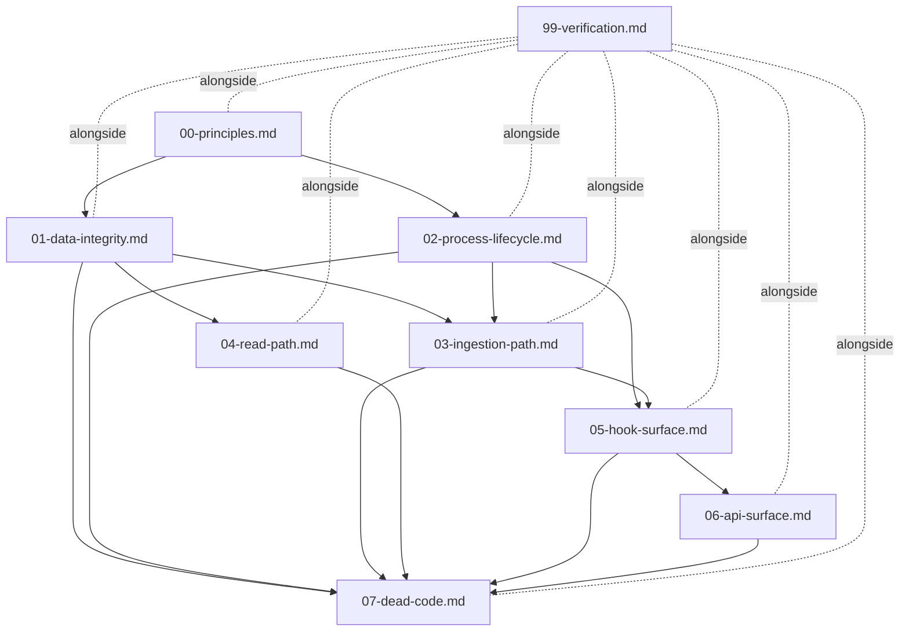

# 98 — Execution Order

## Purpose

This document is the dependency DAG, preflight gates, critical path, parallel branches, and post-landing verification pointer for the entire `PATHFINDER-2026-04-22/` corpus. It tells an executor which plan to open first, which can run in parallel, which invariants are owned by which plan (so two plans never both change the same contract), and what must be true of the environment before Phase 1 of anything starts. It is consumed by the `/do` orchestrator, by Phase 7 principle-cross-check, and by any engineer executing a phase from a fresh chat. It does not duplicate verification greps — those live in `99-verification.md`.

---

## The DAG

### Bulleted dependency list

- `00-principles.md` — root, no deps. Every other plan cites it.
- `01-data-integrity.md` — deps: `{00}`. Owns schema, UNIQUE constraints, self-healing claim, Chroma table shape.
- `02-process-lifecycle.md` — deps: `{00}`. Owns process-group spawn, `kill(-pgid)`, lazy-spawn, shutdown cascade. Independent of `01`.
- `03-ingestion-path.md` — deps: `{01, 02}`. Needs `UNIQUE(session_id, tool_use_id)` on `pending_messages` (from `01` §Phase 1) and the process-group spawn contract (from `02` §Phase 2) that its SDK children inherit.
- `04-read-path.md` — deps: `{01}`. Needs the Chroma table shape + `chroma_synced` column (from `01` §Phase 2). Does NOT depend on `02` — the read path runs inside the already-spawned worker.
- `05-hook-surface.md` — deps: `{02, 03}`. Needs the lazy-spawn contract (`02` §Phase 8) and `summaryStoredEvent` emission (`03` §Phase 2) for the blocking `/api/session/end` endpoint.
- `06-api-surface.md` — deps: `{05}`. The `/api/session/end` body schema that Zod validates is defined by `05`'s hook-side contract; Zod middleware wraps that contract, it doesn't define it.
- `07-dead-code.md` — deps: `{00, 01, 02, 03, 04, 05, 06}`. Sweep plan: runs only after every other plan has deleted what it knows about. Catches orphaned exports / commented-out blocks / dead migrations the other plans missed.
- `99-verification.md` — does NOT sit in the DAG as a blocking node. It runs **alongside** each plan: each plan's phase-level verification checks live here, and the consolidated grep chain + integration tests run after every plan's phases complete.

### ASCII diagram

```
                         00-principles.md
                        /                \
                       v                  v
         01-data-integrity.md     02-process-lifecycle.md
               |    \                       |
               |     \___________           |
               |                 \          |
               v                  v         v
         04-read-path.md       03-ingestion-path.md
               |                          |
               |                          v
               |                 05-hook-surface.md
               |                          |
               |                          v
               |                  06-api-surface.md
               |                          |
               +--------------+-----------+
                              |
                              v
                       07-dead-code.md

         99-verification.md  ←  runs alongside every plan above
                              (acceptance checks; not a blocking node)
```

### Mermaid (equivalent)



### Acyclicity check

Node → incoming edges (must contain no cycle):

- `00` ← ∅
- `01` ← {00}
- `02` ← {00}
- `03` ← {01, 02}
- `04` ← {01}
- `05` ← {02, 03}
- `06` ← {05}
- `07` ← {00, 01, 02, 03, 04, 05, 06}
- `99` ← ∅ (runs alongside; not in the blocking DAG)

Topological sort exists: `00, 01, 02, 03, 04, 05, 06, 07`. All edges point strictly forward in this order. No back-edges. **DAG is acyclic.**

---

## Preflight gates

These MUST be satisfied before Phase 1 of ANY individual plan starts. They are infra/toolchain preconditions that multiple plans depend on; centralising them here prevents plan-by-plan rediscovery.

| # | Gate | Owner of dependency | Verification |
|---|---|---|---|
| PG-1 | `engines.node >= 20.0.0` in `package.json` | `03-ingestion-path.md` §Phase 5 (recursive `fs.watch`) | `jq -r .engines.node package.json` ≥ `20.0.0` |
| PG-2 | `zod@^3.x` installed | `06-api-surface.md` §Phase 1 (Zod middleware) | `npm ls zod` returns `zod@3.*` |
| PG-3 | Prompt-caching cost smoke test harness exists and passes baseline | `04-read-path.md` §Phase 9 (knowledge-corpus simplification — relies on SDK prompt caching) | Three sequential `/api/corpus/:name/query` calls; calls 2 & 3 return `cache_read_input_tokens > 0` |
| PG-4 | Chroma MCP availability + documented upsert-conflict error-text pattern | `01-data-integrity.md` §Phase 7 (`CHROMA_SYNC_FALLBACK_ON_CONFLICT` flag) | Chroma MCP reachable from worker; error-text regex captured in `01-data-integrity.md` §Phase 7 |

If any gate is red, STOP. Fix the gate (install Node 20, install zod, write the smoke-test harness, document the Chroma error text) before touching any plan.

---

## Critical path

**Sequence**: `00 → 01 → 02 → 03 → 05 → 06 → 07`

(`04` is not on the critical path — it hangs off `01` in parallel with the `02 → 03 → 05 → 06` spine. `99` runs alongside every node and is not on the linear path.)

### Why this order

- **`00` first**: every other plan cites the seven principles and six anti-pattern guards verbatim. If `00` changes mid-corpus, every downstream plan's citations go stale. Land `00` and freeze it.
- **`01` and `02` are both "foundational"**: plans `03`, `04`, `05` all depend on at least one of them. `01` owns the schema shape (UNIQUE constraints, `worker_pid`, `chroma_synced`) that `03` and `04` read/write against. `02` owns the spawn contract (`detached: true` + `pgid` tracking) that `03`'s SDK children and `05`'s lazy-spawn wrapper both inherit. Neither can be skipped; both must land before anything that reads their contracts.
- **`03` before `05`**: `summaryStoredEvent` is emitted inside the ingestion path (`03` §Phase 2). The blocking `/api/session/end` endpoint in `05` §Phase 3 awaits that event. If `05` lands first, the endpoint awaits an event that nothing fires — it hangs.
- **`05` before `06`**: the Zod schemas in `06` §Phase 3 validate request bodies for the hook-facing endpoints. The shape of those bodies (for `/api/session/end`, `/api/session/start`, `/api/observations`, etc.) is defined by `05`'s hook-side contract. `06` wraps a contract `05` defines; it cannot define it first.
- **`07` last**: the sweep plan uses `ts-prune` / `knip` to catch unused exports. An export is only "unused" after every plan that used to reference it has deleted those references. Running `07` earlier would produce a false-negative list. Running it last produces the real residue.

---

## Parallel branches

- **`04-read-path.md` runs after `01` independently of `02`.** The read path (renderer, search, Chroma fail-fast, knowledge corpus) operates entirely inside the already-spawned worker process. It reads the Chroma table shape (`01`) but never spawns, kills, or supervises processes (`02`). A second engineer can own `04` while the first engineer drives the `02 → 03 → 05 → 06` spine.
- **`07-dead-code.md` has exactly one concurrency mode: last.** It is a whole-tree sweep. Running it in parallel with any of `01`–`06` produces stale results because those plans are still deleting code.
- **Within a single plan, phases may be parallelized** if the plan text does not specify an ordering between them. The plan author's phase numbering is advisory unless a phase explicitly states "depends on Phase N." Most plans are internally ordered; assume sequential unless the plan says otherwise.

---

## Cross-plan invariants

Each invariant below has **exactly one owner**. Consumers reference the owner's contract; they do not redefine it. Derived from `_mapping.md` §Cross-plan coupling points.

| Invariant | Owner (single source of truth) | Consumers |
|---|---|---|
| `UNIQUE(session_id, tool_use_id)` on `pending_messages` | `01-data-integrity.md` §Phase 1 | `03-ingestion-path.md` §Phase 6 (DB-backed tool pairing) |
| `worker_pid` column + self-healing claim query | `01-data-integrity.md` §Phase 3 | All worker claim call sites; kills per-row `started_processing_at_epoch` |
| `chroma_synced` column + boot-once backfill | `01-data-integrity.md` §Phase 2 | Chroma sync module; read-path fail-fast in `04-read-path.md` §Phase 5 |
| `RECENCY_WINDOW_MS` single source | `04-read-path.md` §Phase 4 (consolidation; constant itself in `types.ts:16`) | Every search / filter call site; seven hand-rolled copies in `SearchManager` deleted |
| Process groups / `pgid` spawn + `kill(-pgid)` shutdown | `02-process-lifecycle.md` §Phases 2–3 | `05-hook-surface.md` §Phase 8 (lazy-spawn uses same `detached: true` contract) |
| `summaryStoredEvent` emission | `03-ingestion-path.md` §Phase 2 | `05-hook-surface.md` §Phase 3 (blocking `/api/session/end` awaits this event) |
| `ingestObservation` / `ingestPrompt` / `ingestSummary` direct helpers | `03-ingestion-path.md` §Phase 0 | Transcript watcher (`03` §Phase 7), hook handlers (`05`), worker HTTP routes (`06`) |
| `renderObservations(obs, strategy)` single renderer | `04-read-path.md` §Phase 1 | All formatters (deleted), search results, corpus detail view |
| Zod schemas + `validateBody` middleware | `06-api-surface.md` §Phases 2–3 | All POST/PUT route handlers; hook-side contracts defined by `05` |
| `performGracefulShutdown` single shutdown path | `06-api-surface.md` §Phase 8 | `02-process-lifecycle.md` §Phase 3 (references only, does not duplicate); `WorkerService.shutdown`, `runShutdownCascade`, `stopSupervisor` wrappers all deleted |
| `stripMemoryTags` single-regex alternation | `03-ingestion-path.md` §Phase 8 | All ingestion paths (tag-stripping utility) |
| `transitionMessagesTo(status)` single failure-marking path | `06-api-surface.md` §Phase 9 | Replaces `markSessionMessagesFailed` + `markAllSessionMessagesAbandoned` |

**Invariant discipline**: if Phase 7 principle-cross-check finds two plans defining the same invariant, the non-owner plan gets sent back for revision. Shared ownership is a bug.

---

## Blocking issues

Inherited verbatim from `_rewrite-plan.md` §Known gaps and old `PATHFINDER-2026-04-21/08-reconciliation.md` Part 5. Each issue blocks the phase that depends on it; none block the whole corpus.

1. **Chroma upsert fallback is brittle.** The delete-then-add bridge pattern depends on Chroma's exact error text when a duplicate ID is upserted. **Blocks**: `01-data-integrity.md` §Phase 7. **Resolution**: flag `CHROMA_SYNC_FALLBACK_ON_CONFLICT=true`; document the exact error regex; remove once Chroma MCP adds native upsert. (PG-4 enforces this.)
2. **Prompt-caching TTL assumption.** The knowledge-corpus simplification relies on the SDK's prompt-caching behavior being stable across the 5-min TTL window. **Blocks**: `04-read-path.md` §Phase 9. **Resolution**: cost smoke test (PG-3) must pass before `04` §Phase 9 ships. If caching degrades, the plan reverts to an explicit cache-control strategy.
3. **Windows process-group behavior.** `process.kill(-pgid)` is Unix-only; Windows needs Job Objects. **Blocks**: `02-process-lifecycle.md` on Windows only. **Resolution**: plan `02` documents Windows as a "platform caveat" section with Job Objects as follow-up. Unix ships first; Windows follow-up is tracked but not in this corpus.
4. **`respawn` dep decision.** The lazy-spawn wrapper needs a retry strategy for startup failure. **Resolved** in `02-process-lifecycle.md` §Phase 8: **hand-roll a 3-attempt retry with exponential backoff**. Do NOT adopt the `respawn` npm dep — adds supply-chain surface for 20 lines of retry logic.
5. **Snapshot tests for renderer collapse.** Without byte-equality snapshots of the four old formatters, regressions from collapsing to `renderObservations(obs, strategy)` are invisible. **Blocks**: `04-read-path.md` §Phase 2 (formatter deletion). **Resolution**: MANDATORY — capture snapshots of `AgentFormatter`, `HumanFormatter`, `ResultFormatter`, `CorpusRenderer` output on a fixed input set BEFORE deleting any of them. Snapshot diff = 0 bytes or the phase fails.

---

## Post-landing verification

See `99-verification.md` for:

- Consolidated grep chain (every `grep -rn "..." src/ → 0` target from every plan's verification section, deduplicated)
- Integration test list (kill-mid-claim, SIGTERM worker, Chroma down, malformed POST, consecutive hook failures)
- Prompt-caching cost smoke test procedure
- Viewer regression harness (12 invariants I1–I12, 11 tests T1–T11)
- Final acceptance criteria (net LoC, test pass, viewer regression pass, cost smoke pass)

Do not duplicate verification content here. This document is structural (DAG, gates, ownership). `99-verification.md` is operational (what to run, what must pass).

---

## How to execute a phase from a fresh chat

1. Open a new chat in this repo root (`vivacious-teeth` branch).
2. Load the following files into context (in this order):
   - `PATHFINDER-2026-04-22/_rewrite-plan.md` (master task list)
   - `PATHFINDER-2026-04-22/_reference.md` (code anchors + external API signatures)
   - `PATHFINDER-2026-04-22/_mapping.md` (old → new section map + coupling table)
   - `PATHFINDER-2026-04-22/98-execution-order.md` (this file — for DAG + gates + invariant ownership)
   - `PATHFINDER-2026-04-22/00-principles.md` (principles cited by every plan)
   - Any predecessor plan in the DAG above the one you are executing (e.g., to execute `05`, load `02` and `03`)
   - The plan you are executing
3. Verify all applicable preflight gates (PG-1…PG-4) are green.
4. Execute the plan's phase list **sequentially**, unless the plan explicitly marks phases as parallelizable.
5. After the last phase, run the plan's own verification checklist, then the slice of `99-verification.md` that covers your plan's grep targets and integration tests.
6. Do NOT declare the plan done until every verification item is checked.
7. Commit per-phase (small commits, plan+phase cited in the commit message), not one mega-commit at the end.

---

**Status: READY.** The DAG is acyclic, critical path is single and unambiguous, all four preflight gates are enumerated with owners, twelve cross-plan invariants are documented with single ownership each, and all five known blocking issues from the rewrite plan are carried forward with resolution pointers.
