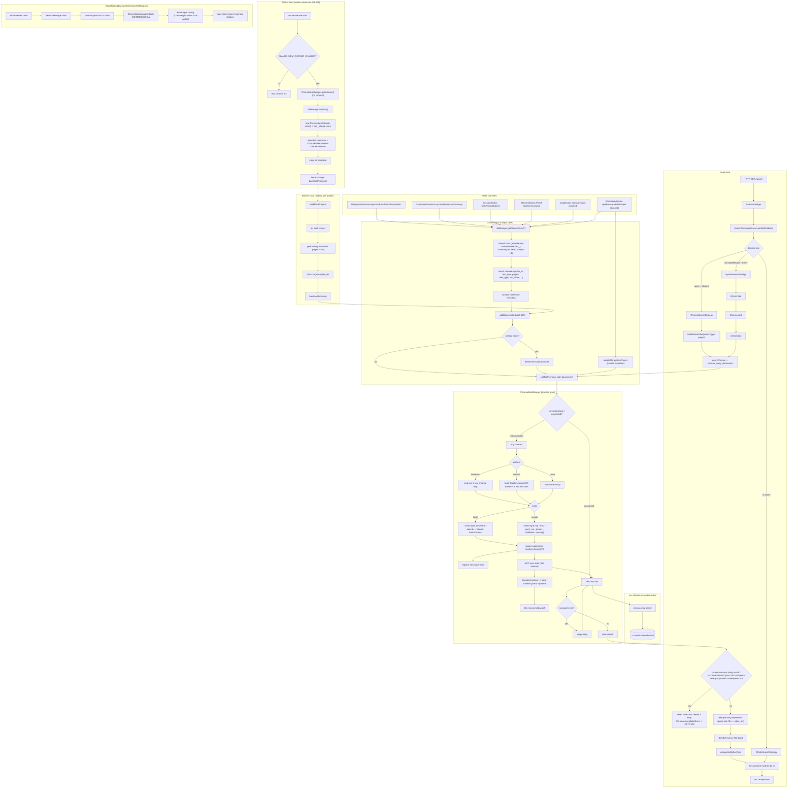
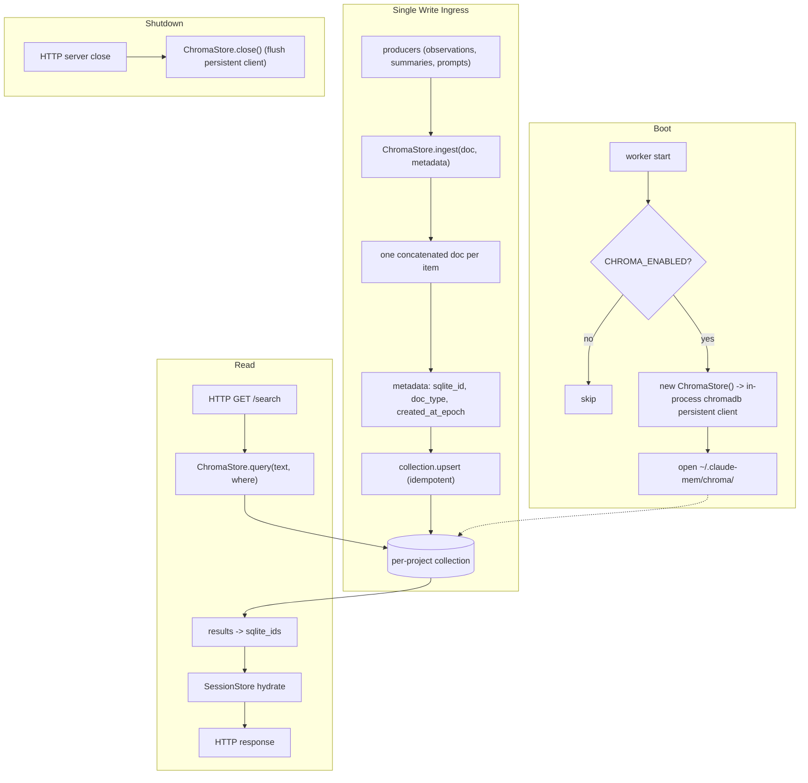

# Chroma System Flowcharts

## AS BUILT

## MINIMAL PATH

**Removed:**
- **Granular per-field doc explosion** — one concatenated doc per observation/summary preserves recall with ~6× fewer vectors and no fact_index/field_type bookkeeping.
- **`field_type` metadata** — never used as a semantic filter; `sqlite_id` already covers hydration.
- **Shared collection + project filter** — per-project collections give cheaper queries and remove the `merged_into_project` rewrite path entirely.
- **`WorktreeAdoption.updateMergedIntoProject`** — dies with the shared-collection model.
- **Backfill on startup** — if writes are awaited and idempotent (upsert), the diff-and-fill loop is dead weight.
- **Dup-reconcile delete+add** — replaced by `upsert` which is one round trip and naturally idempotent.
- **HybridSearchStrategy** — SQLite filter + Chroma rank intersection is a small win for a lot of code; plain Chroma with `where` covers it.
- **90-day recency filter** — not core to "query semantically"; push to caller if needed.
- **MCP-stdio indirection** — chromadb persistent client in-process removes subprocess, supervisor registration, Windows `cmd` shim, Zscaler cert bundle, reconnect backoff, connecting lock, transport retry, and `onclose` stale-handler logic.
- **Singleton + connection-lock + backoff machinery** — gone with the subprocess.
- **Zscaler bundle, Windows `cmd.exe` shim, supervisor registration** — only exist to feed/reap the subprocess.
- **Six write call sites** — collapse to a single ingress; removes the `dbManager.getChromaSync()?` null-dance everywhere.
- **Fire-and-forget vs awaited split** — one awaited path with a bounded queue; failures log and drop, no silent divergence between SQLite and vector store.

